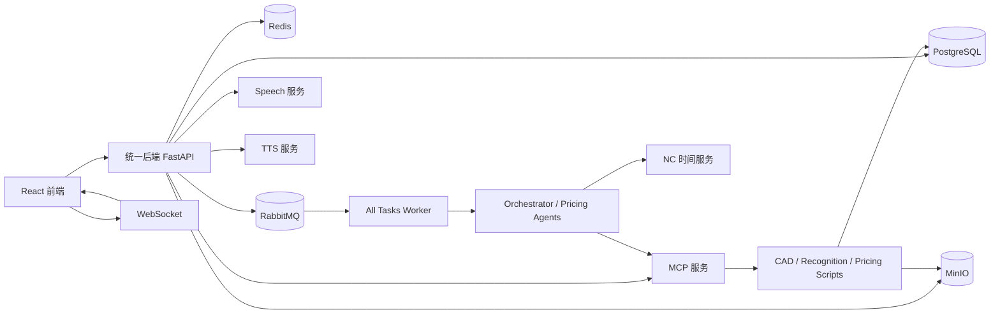
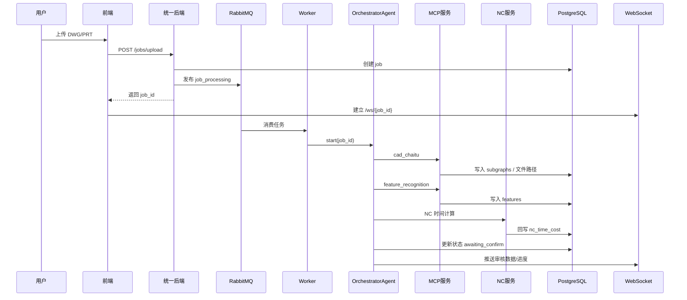

# mold_main Backend README

## 1. 项目概览

`mold_main/backend` 是模具成本核算系统的后端主工程，当前代码把多套历史服务整合到了一个统一后端中，主要负责：

- DWG / PRT 文件上传、任务创建与状态管理
- CAD 拆图、特征识别、NC 时间计算、价格计算编排
- 审核交互、修改确认、重新识别、重新计算
- WebSocket 进度推送与聊天消息持久化
- 报表导出
- 重量计价、价格重算等补充业务
- 语音识别服务
- 文字转语音服务
- MCP 服务封装 CAD / 搜索 / 计算脚本能力

当前运行形态是：

- `main.py` 启动统一 FastAPI 后端
- `main.py` 可内嵌启动 worker
- `mcp_services/cad_price_search_mcp/server.py` 独立启动 MCP 服务
- `speech_services/main.py` 可独立启动语音服务，也可挂载进统一后端
- `tts_services/main.py` 可独立启动 CosyVoice TTS 服务，也可按需挂载进统一后端

---

## 2. 目录结构

```text
backend/
├─ main.py                         # 统一后端启动入口，可内嵌 worker
├─ requirements.txt                # Python 依赖
├─ .env / .env.example             # 环境变量
├─ api_gateway/                    # FastAPI API 网关
│  ├─ main.py                      # FastAPI app、路由挂载、生命周期
│  ├─ routers/                     # 业务路由
│  ├─ services/                    # 任务、文件等服务层
│  └─ utils/                       # RabbitMQ、Redis、日志、格式化等
├─ agents/                         # 编排 Agent / 审核 Agent / 处理器
├─ workers/                        # 队列消费者
├─ shared/                         # 配置、数据库、模型、日志、消息队列等共享模块
├─ scripts/                        # CAD / 特征识别 / 价格计算 / 搜索脚本
├─ mcp_services/
│  └─ cad_price_search_mcp/        # MCP 服务，统一暴露 CAD+搜索+计算工具
├─ speech_services/                # Whisper 语音识别服务
├─ tts_services/                   # CosyVoice 文字转语音服务
├─ logs/                           # 运行日志
└─ app/ / config/ / consumers/     # 历史模块与兼容代码
```

---

## 3. 核心组件

### 3.1 统一后端

入口文件：`main.py`

作用：

- 启动 `api_gateway.main:app`
- 根据 `.env` 配置决定是否内嵌启动 worker
- 在退出时回收 worker 子进程

相关配置：

- `PORT`
- `RELOAD`
- `START_EMBEDDED_WORKER`
- `EMBEDDED_WORKER_ENTRY`

默认当前配置下，内嵌 worker 入口通常为：

```env
EMBEDDED_WORKER_ENTRY=workers/all_tasks_worker.py
```

### 3.2 API Gateway

入口文件：`api_gateway/main.py`

职责：

- 暴露 REST API / WebSocket
- 连接 RabbitMQ / Redis
- 初始化 Action Handlers
- 挂载审核、上传、进度推送、报表、重量计价、账户等路由
- 可选挂载语音识别 / TTS 服务 router

主要路由：

- `api_gateway/routers/jobs.py`
- `api_gateway/routers/review_router.py`
- `api_gateway/routers/features.py`
- `api_gateway/routers/pricing.py`
- `api_gateway/routers/reports.py`
- `api_gateway/routers/weight_price.py`
- `api_gateway/routers/websocket_router.py`

### 3.3 Agents

目录：`agents/`

主要职责：

- `OrchestratorAgent`：主流程编排
- `CADAgent`：调用 MCP 完成拆图 / 特征识别
- `NCTimeAgent`：调用 NC 时间服务并回写数据库
- `PricingAgent`：触发价格计算、批量重算
- `InteractionAgent`：审核对话、修改确认、澄清、刷新
- `ConfirmHandler`：处理“确认”后的重算/重识别/修改等动作
- `action_handlers/`：意图分发与业务处理器

### 3.4 Workers

目录：`workers/`

主要消费者：

- `orchestrator_worker.py`
  - 监听 `job_processing`
  - 负责主流程编排
- `pricing_recalculate_worker.py`
  - 监听 `pricing_recalculate`
  - 负责局部价格重算
- `all_tasks_worker.py`
  - 同时监听 `job_processing` + `pricing_recalculate`
  - 当前建议作为统一 worker 入口

### 3.5 MCP 服务

入口文件：`mcp_services/cad_price_search_mcp/server.py`

职责：

- 封装 CAD 拆图工具
- 封装特征识别工具
- 封装价格搜索脚本
- 封装价格计算脚本
- 通过 HTTP `/call_tool` 或 MCP SSE 暴露工具能力

当前服务能力大致分为：

- 3 个 CAD 工具
- 12 个搜索工具
- 23 个计算工具

### 3.6 语音识别服务

入口文件：`speech_services/main.py`

职责：

- 加载 Whisper 模型
- 提供文件转写、流式转写、WebSocket 转写
- 支持模具行业词典纠错

主要接口：

- `GET /api/speech/health`
- `GET /api/speech/models`
- `POST /api/transcribe`
- `POST /api/transcribe/stream`
- `WS /ws/transcribe`

### 3.7 文字转语音服务

入口文件：`tts_services/main.py`

职责：

- 复用 `D:\AI\Pycharm\chengben2\mold_main\backend\tts_services\CosyVoice` 的推理能力
- 以独立 FastAPI 服务方式暴露文字转语音接口
- 默认加载本地 `CosyVoice-300M-SFT`
- 默认支持 SFT 文本转语音
- 支持按接口参数切换 `zero_shot` / `cross_lingual` / `instruct` / `instruct2`

主要接口：

- `GET /api/tts/health`
- `GET /api/tts/speakers`
- `POST /api/tts/synthesize`
- `GET /api/tts/audio/list`
- `DELETE /api/tts/audio/clean`

---

## 4. 总体架构



---

## 5. 关键业务流程

### 5.1 文件上传到主流程核算



### 5.2 审核修改流程

```mermaid
flowchart TD
    A[前端提交修改文本] --> B[/api/v1/review/{job_id}/modify/]
    B --> C[InteractionAgent 解析意图]
    C --> D{是否需要澄清}
    D -- 是 --> E[生成 clarification]
    E --> F[前端确认 / 选择 / 拒绝]
    F --> G[/clarification/{id}/respond]
    D -- 否 --> H[直接应用修改]
    G --> H
    H --> I[写入数据库]
    I --> J[刷新 review state]
    J --> K[通过 WebSocket 通知前端]
```

### 5.3 继续核算 / 重新计算

```mermaid
flowchart TD
    A[审核确认] --> B[ConfirmHandler]
    B --> C{动作类型}
    C -- 继续核算 --> D[/jobs/{job_id}/continue]
    C -- 价格重算 --> E[/api/pricing/recalculate]
    C -- 重新识别 --> F[/api/features/reprocess]
    D --> G[job_processing 队列]
    E --> H[pricing_recalculate 队列]
    G --> I[OrchestratorWorker]
    H --> J[PricingRecalculateWorker]
    I --> K[更新数据库 + 推送进度]
    J --> K
```

### 5.4 报表导出

```mermaid
flowchart TD
    A[GET /api/v1/reports/{job_id}/export] --> B[查询 Job / Subgraph / Feature]
    B --> C{子图数是否超过阈值}
    C -- 否 --> D[xlsxwriter 同步生成]
    C -- 是 --> E[后台任务异步生成]
    D --> F[StreamingResponse 下载]
    E --> G[上传 MinIO 或落地 temp_reports]
    G --> H[/status 查询导出状态]
```

---

## 6. 外部依赖

后端不是纯 Python 单体，完整功能依赖多个外部系统。

### 6.1 基础中间件

必须：

- PostgreSQL
- RabbitMQ
- Redis
- MinIO

### 6.2 计算与识别相关服务

按功能启用：

- NC 时间服务
- MCP 服务
- Whisper 语音服务
- CosyVoice TTS 服务

### 6.3 本地工具 / 二进制依赖

按 CAD / 3D / 语音场景需要：

- ODA File Converter
- Siemens NX / NXOpen
- `run_journal.exe` 相关 NX journal 能力
- `ffmpeg`

---

## 7. Python 依赖安装

### 7.1 创建虚拟环境

示例：

```powershell
cd D:\AI\Pycharm\chengben2\mold_main\backend
python -m venv .venv
.venv\Scripts\activate
```

或者使用你现有的 Anaconda 环境。

### 7.2 安装 requirements

```powershell
pip install -r requirements.txt
```

主要依赖包括：

- FastAPI / Uvicorn
- SQLAlchemy / asyncpg / psycopg2
- aio-pika / redis / minio
- pydantic / python-dotenv
- httpx / aiohttp
- langchain / openai
- openai-whisper / torch

### 7.3 语音额外依赖

语音服务除 Python 包外，还需要：

- `ffmpeg.exe`

并在 `.env` 中配置：

```env
FFMPEG_PATH=C:\path\to\ffmpeg.exe
```

### 7.4 NX / 3D 额外依赖

如果要启用 `.x_t` 导出、红色面提取等 NX 相关能力，需要：

- 安装 Siemens NX
- 让 MCP 服务进程运行在可导入 `NXOpen` 的环境里

最常见做法是在启动 MCP 的同一个 PowerShell 窗口先设置：

```powershell
$env:PYTHONPATH="D:\Program Files\Siemens\NX2312\NXBIN\python"
python -c "import NXOpen; print('NXOpen OK')"
```

确认 `NXOpen OK` 后，再在同一窗口启动 MCP。

### 7.5 TTS 额外依赖

CosyVoice 建议使用单独环境启动，不强依赖 `backend/requirements.txt`。

推荐直接安装 `CosyVoice` 自己的依赖：

```powershell
cd D:\AI\Pycharm\chengben2\mold_main\backend\tts_services\CosyVoice
pip install -r requirements.txt
```

当前 TTS 服务默认依赖这些路径：

- `D:\AI\Pycharm\chengben2\mold_main\backend\tts_services\CosyVoice`
- `D:\AI\Pycharm\chengben2\mold_main\backend\tts_services\CosyVoice\third_party\Matcha-TTS`
- `D:\AI\Pycharm\chengben2\mold_main\backend\tts_services\CosyVoice\pretrained_models\CosyVoice-300M-SFT`

如果你用的是独立 Conda 环境，建议在那个环境里直接启动 `tts_services/main.py`。

---

## 8. 环境变量说明

配置来源：`.env`

常用关键项如下。

### 8.1 服务基础配置

```env
PORT=8212
DEBUG=true
RELOAD=false
START_EMBEDDED_WORKER=true
EMBEDDED_WORKER_ENTRY=workers/all_tasks_worker.py
```

说明：

- `PORT`：统一后端端口
- `RELOAD`：开发热重载，建议重服务场景下关闭
- `START_EMBEDDED_WORKER`：是否随 `main.py` 启动 worker
- `EMBEDDED_WORKER_ENTRY`：内嵌 worker 入口

### 8.2 数据库与中间件

```env
DB_HOST=
DB_PORT=5432
DB_NAME=
DB_USER=
DB_PASSWORD=

REDIS_URL=redis://...

RABBITMQ_HOST=
RABBITMQ_PORT=5672
RABBITMQ_USER=
RABBITMQ_PASSWORD=

MINIO_ENDPOINT=
MINIO_ACCESS_KEY=
MINIO_SECRET_KEY=
MINIO_BUCKET_FILES=files
```

### 8.3 外部服务

```env
CAD_PRICE_SEARCH_MCP_URL=http://127.0.0.1:8201
NC_AGENT_URL=http://127.0.0.1:8001
SPEECH_SERVICE_URL=http://127.0.0.1:8888
TTS_SERVICE_URL=http://127.0.0.1:8890
WEIGHT_PRICE_API_URL=http://127.0.0.1:8212/api/price_wg/calculate
FEATURE_REPROCESS_API_URL=http://127.0.0.1:8212/api/features/reprocess
PRICING_RECALCULATE_API_URL=http://127.0.0.1:8212/api/pricing/recalculate
```

### 8.4 大模型

```env
OPENAI_API_KEY=
OPENAI_MODEL=
OPENAI_BASE_URL=
LLM_TIMEOUT=30
API_TIMEOUT=60
```

### 8.5 语音服务

```env
SPEECH_DEFAULT_MODEL=small
SPEECH_DEFAULT_LANGUAGE=zh
SPEECH_MODEL_DIR=
SPEECH_HOST=0.0.0.0
SPEECH_PORT=8888
FFMPEG_PATH=C:\path\to\ffmpeg.exe
```

### 8.6 TTS 服务

```env
COSYVOICE_ROOT=D:\AI\Pycharm\chengben2\mold_main\backend\tts_services\CosyVoice
TTS_MODEL_DIR=D:\AI\Pycharm\chengben2\mold_main\backend\tts_services\CosyVoice\pretrained_models\CosyVoice-300M-SFT
TTS_DEFAULT_MODE=sft
TTS_HOST=0.0.0.0
TTS_PORT=8890
TTS_SERVICE_URL=http://127.0.0.1:8890
```

### 8.7 NX / CAD 相关

项目内实际还依赖这些路径或外部变量：

- ODA converter 路径
- NX 安装目录
- UGII / NXBIN 相关环境变量

这些通常由 CAD 脚本和 NX 环境自行读取，不完全由 `shared/config.py` 暴露。

---

## 9. 启动方式

推荐按“最小稳定可用”方式启动。

### 9.1 启动 MCP 服务

普通模式：

```powershell
cd D:\AI\Pycharm\chengben2\mold_main\backend
python mcp_services\cad_price_search_mcp\server.py
```

如果需要 NX 导出 `.x_t` / 3D 红色面：

```powershell
cd D:\AI\Pycharm\chengben2\mold_main\backend
$env:PYTHONPATH="D:\Program Files\Siemens\NX2312\NXBIN\python"
python -c "import NXOpen; print('NXOpen OK')"
python mcp_services\cad_price_search_mcp\server.py
```

### 9.2 启动统一后端

```powershell
cd D:\AI\Pycharm\chengben2\mold_main\backend
python main.py
```

当前这条命令会：

- 启动统一 FastAPI 后端
- 如果 `START_EMBEDDED_WORKER=true`，同时拉起内嵌 worker
- 如果 `EMBEDDED_WORKER_ENTRY=workers/all_tasks_worker.py`，则同时监听：
  - `job_processing`
  - `pricing_recalculate`

### 9.3 启动语音服务

独立启动：

```powershell
cd D:\AI\Pycharm\chengben2\mold_main\backend
python speech_services\main.py
```

建议先确认启动日志里出现：

```text
FFmpeg: C:\...\ffmpeg.exe
```

如果显示 `FFmpeg: NOT FOUND`，流式语音识别会失败。

### 9.4 启动 TTS 服务

建议使用已经装好 CosyVoice 依赖的独立环境启动：

```powershell
cd D:\AI\Pycharm\chengben2\mold_main\backend
python tts_services\main.py
```

默认端口：

```text
8890
```

默认模型目录：

```text
D:\AI\Pycharm\chengben2\mold_main\backend\tts_services\CosyVoice\pretrained_models\CosyVoice-300M-SFT
```

### 9.5 典型完整启动顺序

```powershell
# 终端 1：MCP
cd D:\AI\Pycharm\chengben2\mold_main\backend
python mcp_services\cad_price_search_mcp\server.py
```

```powershell
# 终端 2：统一后端 + worker
cd D:\AI\Pycharm\chengben2\mold_main\backend
python main.py
```

```powershell
# 终端 3：语音服务（如果不走统一挂载）
cd D:\AI\Pycharm\chengben2\mold_main\backend
python speech_services\main.py
```

```powershell
# 终端 4：TTS 服务（CosyVoice）
cd D:\AI\Pycharm\chengben2\mold_main\backend
python tts_services\main.py
```

---

## 10. 运行后如何验证

### 10.1 统一后端

```powershell
curl http://127.0.0.1:8212/health
```

### 10.2 MCP 服务

```powershell
curl http://127.0.0.1:8201/health
```

### 10.3 语音服务

```powershell
curl http://127.0.0.1:8888/api/speech/health
```

### 10.4 WebSocket

前端连接：

```text
/ws/{job_id}
```

成功后应看到 `connected` / `ping` / `pong` / `progress` 等消息。

### 10.5 TTS 服务

```powershell
curl http://127.0.0.1:8890/api/tts/health
```

查看可用音色：

```powershell
curl http://127.0.0.1:8890/api/tts/speakers
```

---

## 11. 常见日志文件

日志目录：`logs/`

常见文件：

- `app.log`
- `error.log`
- `api_gateway.log`
- `workers.log`
- `agents.log`
- `shared.log`
- `scripts.log`
- `mcp_service.log`
- `all_tasks_worker.log`

排查建议：

- 上传后没动静：看 `app.log` + `workers.log`
- 拆图/识别失败：看 `mcp_service.log`
- 审核/确认异常：看 `agents.log` + `api_gateway.log`
- 重算没执行：看 `all_tasks_worker.log`
- 语音 500：看 `speech_services` 控制台输出

TTS 服务生成的音频默认保存在：

- `tts_services/audio/`

---

## 12. 常见问题

### 12.1 上传成功后没有后续动作

先检查：

- 是否启动了 worker
- `main.py` 是否内嵌启动了 `all_tasks_worker.py`
- RabbitMQ 是否连接成功

### 12.2 重新计算确认后没有执行

先检查：

- `pricing_recalculate` 队列是否有消费者
- `.env` 中 `EMBEDDED_WORKER_ENTRY` 是否指向 `workers/all_tasks_worker.py`

### 12.3 MCP 返回 502 / 拆图失败

先检查：

- MCP 是否真的启动在 `CAD_PRICE_SEARCH_MCP_URL` 指向的端口
- 请求是否命中 `/call_tool`
- `mcp_service.log` 是否有内部 traceback

### 12.4 没有 `.x_t` / 没有上传 MinIO / 没有 3D 面积

先检查：

- MCP 是否在可用的 NX 环境启动
- 启动日志里是否能 `import NXOpen`
- `mcp_service.log` 是否出现“非 NX 环境，跳过 .x_t 导出”

### 12.5 语音识别 500

先检查：

- `FFMPEG_PATH` 是否已配置
- 语音启动日志是否显示 `FFmpeg: NOT FOUND`
- 前端上传的音频格式是否与后端接收一致

### 12.6 TTS 启动失败或不出声

先检查：

- `COSYVOICE_ROOT` 是否指向真实 CosyVoice 根目录
- `TTS_MODEL_DIR` 是否指向真实模型目录
- 当前 Python 环境是否已安装 `CosyVoice/requirements.txt`
- `CosyVoice-300M-SFT` 模型是否完整
- 如果是 `zero_shot` / `cross_lingual` / `instruct2`，是否上传了参考音频

---

## 13. 开发建议

- 重服务场景建议 `RELOAD=false`
- MCP、NX、语音尽量独立进程跑，排障更直接
- 队列消费者统一使用 `all_tasks_worker.py`
- 修改 `.env` 后必须重启对应服务
- 对外部服务问题优先看各自日志，而不是只看统一后端日志

---

## 14. 建议的最简运行基线

如果你的目标是先稳定跑通“上传 -> 拆图 -> 识别 -> 审核 -> 继续核算 -> 导出”，推荐基线：

1. PostgreSQL / Redis / RabbitMQ / MinIO 已启动
2. MCP 服务已启动
3. `python main.py` 已启动，并内嵌 `all_tasks_worker.py`
4. 前端已指向统一后端
5. 如需语音，再单独启动 `speech_services/main.py`
6. 如需文字转语音，再单独启动 `tts_services/main.py`

---

## 15. 关键文件索引

- `main.py`
- `api_gateway/main.py`
- `api_gateway/routers/jobs.py`
- `api_gateway/routers/review_router.py`
- `api_gateway/routers/reports.py`
- `workers/all_tasks_worker.py`
- `workers/orchestrator_worker.py`
- `workers/pricing_recalculate_worker.py`
- `shared/config.py`
- `shared/message_queue.py`
- `agents/orchestrator_agent.py`
- `agents/interaction_agent.py`
- `agents/pricing_agent.py`
- `agents/nc_time_agent.py`
- `mcp_services/cad_price_search_mcp/server.py`
- `speech_services/main.py`
- `tts_services/main.py`

文字转语音依赖
pip install hyperpyyaml
pip install modelscope
pip install onnxruntime
pip install inflect
pip install transformers
pip install omegaconf
pip install scipy
pip install conformer
pip install diffusers
pip install gdown
pip install lightning
pip install matplotlib
pip install wget
pip install pyarrow
pip install pyworld
pip install librosa