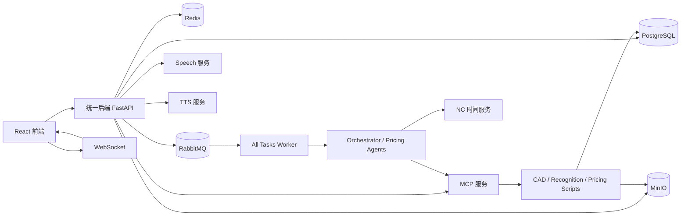
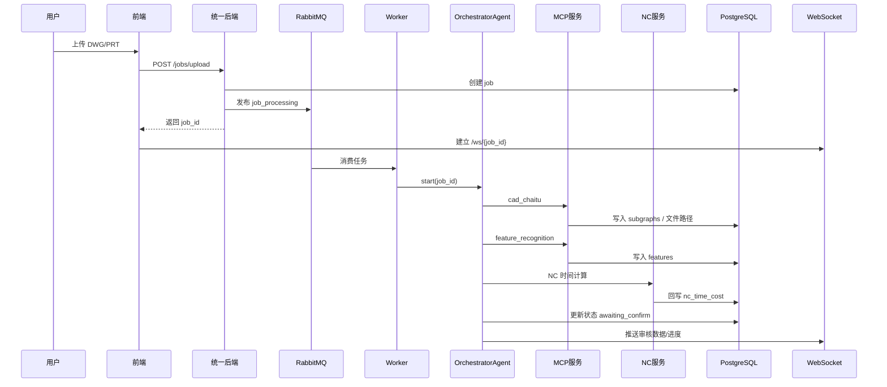
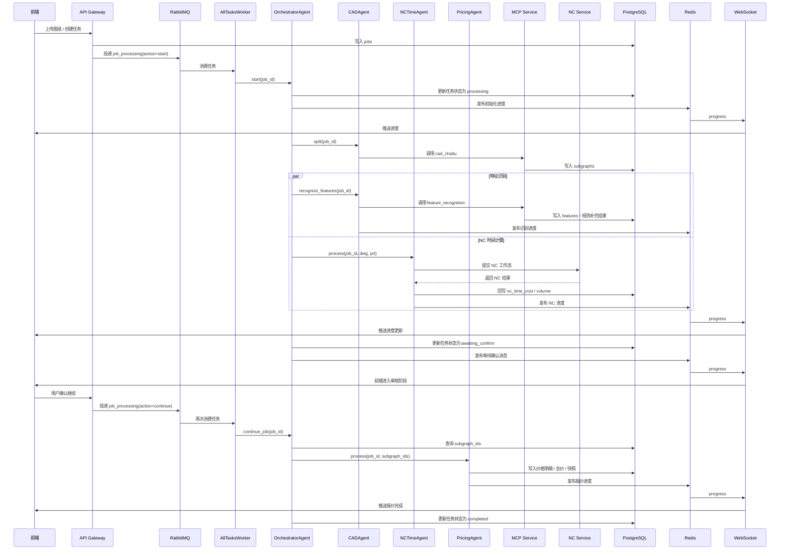
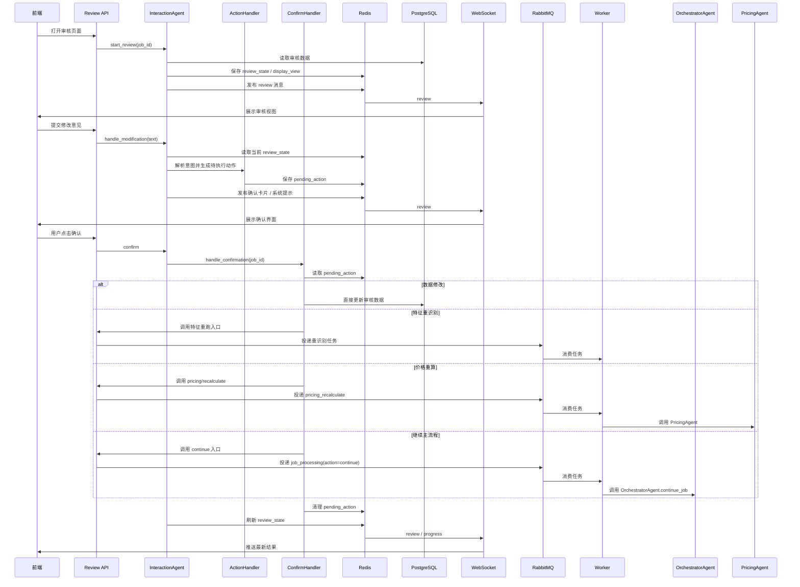
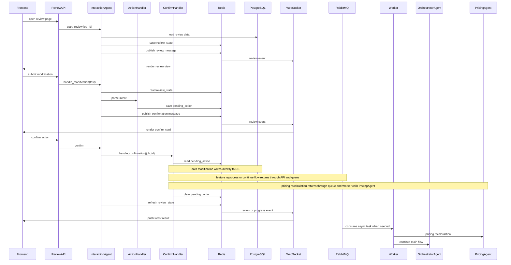
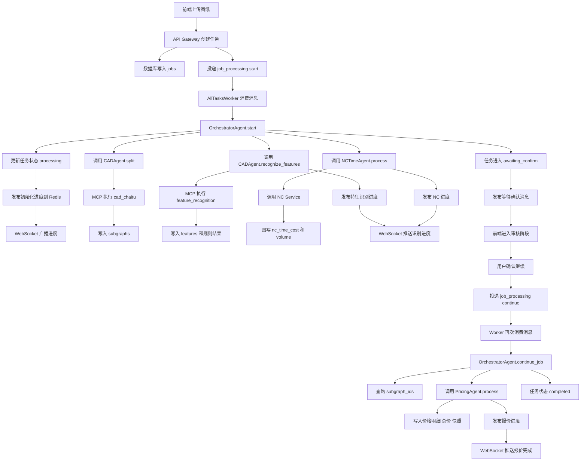
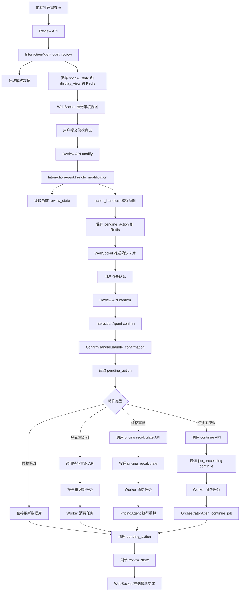

# mold_main Backend README

## 1. 项目概览

`mold_main/backend` 是模具成本核算系统的后端主工程，当前代码把多套历史服务整合到了一个统一后端中，主要负责：

- DWG / PRT 文件上传、任务创建与状态管理
- CAD 拆图、特征识别、NC 时间计算、价格计算编排
- 审核交互、修改确认、重新识别、重新计算
- WebSocket 进度推送与聊天消息持久化
- 报表导出
- 重量计价、价格重算等补充业务
- 语音识别服务
- 文字转语音服务
- MCP 服务封装 CAD / 搜索 / 计算脚本能力

当前运行形态是：

- `main.py` 启动统一 FastAPI 后端
- `main.py` 可内嵌启动 worker
- `mcp_services/cad_price_search_mcp/server.py` 独立启动 MCP 服务
- `speech_services/main.py` 可独立启动语音服务，也可挂载进统一后端
- `tts_services/main.py` 可独立启动 CosyVoice TTS 服务，也可按需挂载进统一后端

---

## 2. 目录结构

```text
backend/
├─ main.py                         # 统一后端启动入口，可内嵌 worker
├─ requirements.txt                # Python 依赖
├─ .env / .env.example             # 环境变量
├─ api_gateway/                    # FastAPI API 网关
│  ├─ main.py                      # FastAPI app、路由挂载、生命周期
│  ├─ routers/                     # 业务路由
│  ├─ services/                    # 任务、文件等服务层
│  └─ utils/                       # RabbitMQ、Redis、日志、格式化等
├─ agents/                         # 编排 Agent / 审核 Agent / 处理器
├─ workers/                        # 队列消费者
├─ shared/                         # 配置、数据库、模型、日志、消息队列等共享模块
├─ scripts/                        # CAD / 特征识别 / 价格计算 / 搜索脚本
├─ mcp_services/
│  └─ cad_price_search_mcp/        # MCP 服务，统一暴露 CAD+搜索+计算工具
├─ speech_services/                # Whisper 语音识别服务
├─ tts_services/                   # CosyVoice 文字转语音服务
├─ logs/                           # 运行日志
└─ app/ / config/ / consumers/     # 历史模块与兼容代码
```

---

## 3. 核心组件

### 3.1 统一后端

入口文件：`main.py`

作用：

- 启动 `api_gateway.main:app`
- 根据 `.env` 配置决定是否内嵌启动 worker
- 在退出时回收 worker 子进程

相关配置：

- `PORT`
- `RELOAD`
- `START_EMBEDDED_WORKER`
- `EMBEDDED_WORKER_ENTRY`

默认当前配置下，内嵌 worker 入口通常为：

```env
EMBEDDED_WORKER_ENTRY=workers/all_tasks_worker.py
```

### 3.2 API Gateway

入口文件：`api_gateway/main.py`

职责：

- 暴露 REST API / WebSocket
- 连接 RabbitMQ / Redis
- 初始化 Action Handlers
- 挂载审核、上传、进度推送、报表、重量计价、账户等路由
- 可选挂载语音识别 / TTS 服务 router

主要路由：

- `api_gateway/routers/jobs.py`
- `api_gateway/routers/review_router.py`
- `api_gateway/routers/features.py`
- `api_gateway/routers/pricing.py`
- `api_gateway/routers/reports.py`
- `api_gateway/routers/weight_price.py`
- `api_gateway/routers/websocket_router.py`

### 3.3 Agents

目录：`agents/`

主要职责：

- `OrchestratorAgent`：主流程编排
- `CADAgent`：调用 MCP 完成拆图 / 特征识别
- `NCTimeAgent`：调用 NC 时间服务并回写数据库
- `PricingAgent`：触发价格计算、批量重算
- `InteractionAgent`：审核对话、修改确认、澄清、刷新
- `ConfirmHandler`：处理“确认”后的重算/重识别/修改等动作
- `action_handlers/`：意图分发与业务处理器

### 3.4 Workers

目录：`workers/`

主要消费者：

- `orchestrator_worker.py`
  - 监听 `job_processing`
  - 负责主流程编排
- `pricing_recalculate_worker.py`
  - 监听 `pricing_recalculate`
  - 负责局部价格重算
- `all_tasks_worker.py`
  - 同时监听 `job_processing` + `pricing_recalculate`
  - 当前建议作为统一 worker 入口

### 3.5 MCP 服务

入口文件：`mcp_services/cad_price_search_mcp/server.py`

职责：

- 封装 CAD 拆图工具
- 封装特征识别工具
- 封装价格搜索脚本
- 封装价格计算脚本
- 通过 HTTP `/call_tool` 或 MCP SSE 暴露工具能力

当前服务能力大致分为：

- 3 个 CAD 工具
- 12 个搜索工具
- 23 个计算工具

### 3.6 语音识别服务

入口文件：`speech_services/main.py`

职责：

- 加载 Whisper 模型
- 提供文件转写、流式转写、WebSocket 转写
- 支持模具行业词典纠错

主要接口：

- `GET /api/speech/health`
- `GET /api/speech/models`
- `POST /api/transcribe`
- `POST /api/transcribe/stream`
- `WS /ws/transcribe`

### 3.7 文字转语音服务

入口文件：`tts_services/main.py`

职责：

- 复用 `D:\AI\Pycharm\chengben2\mold_main\backend\tts_services\CosyVoice` 的推理能力
- 以独立 FastAPI 服务方式暴露文字转语音接口
- 默认加载本地 `CosyVoice-300M-SFT`
- 默认支持 SFT 文本转语音
- 支持按接口参数切换 `zero_shot` / `cross_lingual` / `instruct` / `instruct2`

主要接口：

- `GET /api/tts/health`
- `GET /api/tts/speakers`
- `POST /api/tts/synthesize`
- `GET /api/tts/audio/list`
- `DELETE /api/tts/audio/clean`

---

## 4. 总体架构



---

## 5. 关键业务流程

### 5.1 文件上传到主流程核算



### 5.2 审核修改流程

```mermaid
flowchart TD
    A[前端提交修改文本] --> B[/api/v1/review/{job_id}/modify/]
    B --> C[InteractionAgent 解析意图]
    C --> D{是否需要澄清}
    D -- 是 --> E[生成 clarification]
    E --> F[前端确认 / 选择 / 拒绝]
    F --> G[/clarification/{id}/respond]
    D -- 否 --> H[直接应用修改]
    G --> H
    H --> I[写入数据库]
    I --> J[刷新 review state]
    J --> K[通过 WebSocket 通知前端]
```

### 5.3 继续核算 / 重新计算

```mermaid
flowchart TD
    A[审核确认] --> B[ConfirmHandler]
    B --> C{动作类型}
    C -- 继续核算 --> D[/jobs/{job_id}/continue]
    C -- 价格重算 --> E[/api/pricing/recalculate]
    C -- 重新识别 --> F[/api/features/reprocess]
    D --> G[job_processing 队列]
    E --> H[pricing_recalculate 队列]
    G --> I[OrchestratorWorker]
    H --> J[PricingRecalculateWorker]
    I --> K[更新数据库 + 推送进度]
    J --> K
```

### 5.4 报表导出

```mermaid
flowchart TD
    A[GET /api/v1/reports/{job_id}/export] --> B[查询 Job / Subgraph / Feature]
    B --> C{子图数是否超过阈值}
    C -- 否 --> D[xlsxwriter 同步生成]
    C -- 是 --> E[后台任务异步生成]
    D --> F[StreamingResponse 下载]
    E --> G[上传 MinIO 或落地 temp_reports]
    G --> H[/status 查询导出状态]
```

---

## 6. 外部依赖

后端不是纯 Python 单体，完整功能依赖多个外部系统。

### 6.1 基础中间件

必须：

- PostgreSQL
- RabbitMQ
- Redis
- MinIO

### 6.2 计算与识别相关服务

按功能启用：

- NC 时间服务
- MCP 服务
- Whisper 语音服务
- CosyVoice TTS 服务

### 6.3 本地工具 / 二进制依赖

按 CAD / 3D / 语音场景需要：

- ODA File Converter
- Siemens NX / NXOpen
- `run_journal.exe` 相关 NX journal 能力
- `ffmpeg`

---

## 7. Python 依赖安装

### 7.1 创建虚拟环境

示例：

```powershell
cd D:\AI\Pycharm\chengben2\mold_main\backend
python -m venv .venv
.venv\Scripts\activate
```

或者使用你现有的 Anaconda 环境。

### 7.2 安装 requirements

```powershell
pip install -r requirements.txt
```

主要依赖包括：

- FastAPI / Uvicorn
- SQLAlchemy / asyncpg / psycopg2
- aio-pika / redis / minio
- pydantic / python-dotenv
- httpx / aiohttp
- langchain / openai
- openai-whisper / torch

### 7.3 语音额外依赖

语音服务除 Python 包外，还需要：

- `ffmpeg.exe`

并在 `.env` 中配置：

```env
FFMPEG_PATH=C:\path\to\ffmpeg.exe
```

### 7.4 NX / 3D 额外依赖

如果要启用 `.x_t` 导出、红色面提取等 NX 相关能力，需要：

- 安装 Siemens NX
- 让 MCP 服务进程运行在可导入 `NXOpen` 的环境里

最常见做法是在启动 MCP 的同一个 PowerShell 窗口先设置：

```powershell
$env:PYTHONPATH="D:\Program Files\Siemens\NX2312\NXBIN\python"
python -c "import NXOpen; print('NXOpen OK')"
```

确认 `NXOpen OK` 后，再在同一窗口启动 MCP。

### 7.5 TTS 额外依赖

CosyVoice 建议使用单独环境启动，不强依赖 `backend/requirements.txt`。

推荐直接安装 `CosyVoice` 自己的依赖：

```powershell
cd D:\AI\Pycharm\chengben2\mold_main\backend\tts_services\CosyVoice
pip install -r requirements.txt
```

当前 TTS 服务默认依赖这些路径：

- `D:\AI\Pycharm\chengben2\mold_main\backend\tts_services\CosyVoice`
- `D:\AI\Pycharm\chengben2\mold_main\backend\tts_services\CosyVoice\third_party\Matcha-TTS`
- `D:\AI\Pycharm\chengben2\mold_main\backend\tts_services\CosyVoice\pretrained_models\CosyVoice-300M-SFT`

如果你用的是独立 Conda 环境，建议在那个环境里直接启动 `tts_services/main.py`。

---

## 8. 环境变量说明

配置来源：`.env`

常用关键项如下。

### 8.1 服务基础配置

```env
PORT=8212
DEBUG=true
RELOAD=false
START_EMBEDDED_WORKER=true
EMBEDDED_WORKER_ENTRY=workers/all_tasks_worker.py
```

说明：

- `PORT`：统一后端端口
- `RELOAD`：开发热重载，建议重服务场景下关闭
- `START_EMBEDDED_WORKER`：是否随 `main.py` 启动 worker
- `EMBEDDED_WORKER_ENTRY`：内嵌 worker 入口

### 8.2 数据库与中间件

```env
DB_HOST=
DB_PORT=5432
DB_NAME=
DB_USER=
DB_PASSWORD=

REDIS_URL=redis://...

RABBITMQ_HOST=
RABBITMQ_PORT=5672
RABBITMQ_USER=
RABBITMQ_PASSWORD=

MINIO_ENDPOINT=
MINIO_ACCESS_KEY=
MINIO_SECRET_KEY=
MINIO_BUCKET_FILES=files
```

### 8.3 外部服务

```env
CAD_PRICE_SEARCH_MCP_URL=http://127.0.0.1:8201
NC_AGENT_URL=http://127.0.0.1:8001
SPEECH_SERVICE_URL=http://127.0.0.1:8888
TTS_SERVICE_URL=http://127.0.0.1:8890
WEIGHT_PRICE_API_URL=http://127.0.0.1:8212/api/price_wg/calculate
FEATURE_REPROCESS_API_URL=http://127.0.0.1:8212/api/features/reprocess
PRICING_RECALCULATE_API_URL=http://127.0.0.1:8212/api/pricing/recalculate
```

### 8.4 大模型

```env
OPENAI_API_KEY=
OPENAI_MODEL=
OPENAI_BASE_URL=
LLM_TIMEOUT=30
API_TIMEOUT=60
```

### 8.5 语音服务

```env
SPEECH_DEFAULT_MODEL=small
SPEECH_DEFAULT_LANGUAGE=zh
SPEECH_MODEL_DIR=
SPEECH_HOST=0.0.0.0
SPEECH_PORT=8888
FFMPEG_PATH=C:\path\to\ffmpeg.exe
```

### 8.6 TTS 服务

```env
COSYVOICE_ROOT=D:\AI\Pycharm\chengben2\mold_main\backend\tts_services\CosyVoice
TTS_MODEL_DIR=D:\AI\Pycharm\chengben2\mold_main\backend\tts_services\CosyVoice\pretrained_models\CosyVoice-300M-SFT
TTS_DEFAULT_MODE=sft
TTS_HOST=0.0.0.0
TTS_PORT=8890
TTS_SERVICE_URL=http://127.0.0.1:8890
```

### 8.7 NX / CAD 相关

项目内实际还依赖这些路径或外部变量：

- ODA converter 路径
- NX 安装目录
- UGII / NXBIN 相关环境变量

这些通常由 CAD 脚本和 NX 环境自行读取，不完全由 `shared/config.py` 暴露。

---

## 9. 启动方式

推荐按“最小稳定可用”方式启动。

### 9.1 启动 MCP 服务

普通模式：

```powershell
cd D:\AI\Pycharm\chengben2\mold_main\backend
python mcp_services\cad_price_search_mcp\server.py
```

如果需要 NX 导出 `.x_t` / 3D 红色面：

```powershell
cd D:\AI\Pycharm\chengben2\mold_main\backend
$env:PYTHONPATH="D:\Program Files\Siemens\NX2312\NXBIN\python"
python -c "import NXOpen; print('NXOpen OK')"
python mcp_services\cad_price_search_mcp\server.py
```

### 9.2 启动统一后端

```powershell
cd D:\AI\Pycharm\chengben2\mold_main\backend
python main.py
```

当前这条命令会：

- 启动统一 FastAPI 后端
- 如果 `START_EMBEDDED_WORKER=true`，同时拉起内嵌 worker
- 如果 `EMBEDDED_WORKER_ENTRY=workers/all_tasks_worker.py`，则同时监听：
  - `job_processing`
  - `pricing_recalculate`

### 9.3 启动语音服务

独立启动：

```powershell
cd D:\AI\Pycharm\chengben2\mold_main\backend
python speech_services\main.py
```

建议先确认启动日志里出现：

```text
FFmpeg: C:\...\ffmpeg.exe
```

如果显示 `FFmpeg: NOT FOUND`，流式语音识别会失败。

### 9.4 启动 TTS 服务

建议使用已经装好 CosyVoice 依赖的独立环境启动：

```powershell
cd D:\AI\Pycharm\chengben2\mold_main\backend
python tts_services\main.py
```

默认端口：

```text
8890
```

默认模型目录：

```text
D:\AI\Pycharm\chengben2\mold_main\backend\tts_services\CosyVoice\pretrained_models\CosyVoice-300M-SFT
```

### 9.5 典型完整启动顺序

```powershell
# 终端 1：MCP
cd D:\AI\Pycharm\chengben2\mold_main\backend
python mcp_services\cad_price_search_mcp\server.py
```

```powershell
# 终端 2：统一后端 + worker
cd D:\AI\Pycharm\chengben2\mold_main\backend
python main.py
```

```powershell
# 终端 3：语音服务（如果不走统一挂载）
cd D:\AI\Pycharm\chengben2\mold_main\backend
python speech_services\main.py
```

```powershell
# 终端 4：TTS 服务（CosyVoice）
cd D:\AI\Pycharm\chengben2\mold_main\backend
python tts_services\main.py
```

---

## 10. 运行后如何验证

### 10.1 统一后端

```powershell
curl http://127.0.0.1:8212/health
```

### 10.2 MCP 服务

```powershell
curl http://127.0.0.1:8201/health
```

### 10.3 语音服务

```powershell
curl http://127.0.0.1:8888/api/speech/health
```

### 10.4 WebSocket

前端连接：

```text
/ws/{job_id}
```

成功后应看到 `connected` / `ping` / `pong` / `progress` 等消息。

### 10.5 TTS 服务

```powershell
curl http://127.0.0.1:8890/api/tts/health
```

查看可用音色：

```powershell
curl http://127.0.0.1:8890/api/tts/speakers
```

---

## 11. 常见日志文件

日志目录：`logs/`

常见文件：

- `app.log`
- `error.log`
- `api_gateway.log`
- `workers.log`
- `agents.log`
- `shared.log`
- `scripts.log`
- `mcp_service.log`
- `all_tasks_worker.log`

排查建议：

- 上传后没动静：看 `app.log` + `workers.log`
- 拆图/识别失败：看 `mcp_service.log`
- 审核/确认异常：看 `agents.log` + `api_gateway.log`
- 重算没执行：看 `all_tasks_worker.log`
- 语音 500：看 `speech_services` 控制台输出

TTS 服务生成的音频默认保存在：

- `tts_services/audio/`

---

## 12. 常见问题

### 12.1 上传成功后没有后续动作

先检查：

- 是否启动了 worker
- `main.py` 是否内嵌启动了 `all_tasks_worker.py`
- RabbitMQ 是否连接成功

### 12.2 重新计算确认后没有执行

先检查：

- `pricing_recalculate` 队列是否有消费者
- `.env` 中 `EMBEDDED_WORKER_ENTRY` 是否指向 `workers/all_tasks_worker.py`

### 12.3 MCP 返回 502 / 拆图失败

先检查：

- MCP 是否真的启动在 `CAD_PRICE_SEARCH_MCP_URL` 指向的端口
- 请求是否命中 `/call_tool`
- `mcp_service.log` 是否有内部 traceback

### 12.4 没有 `.x_t` / 没有上传 MinIO / 没有 3D 面积

先检查：

- MCP 是否在可用的 NX 环境启动
- 启动日志里是否能 `import NXOpen`
- `mcp_service.log` 是否出现“非 NX 环境，跳过 .x_t 导出”

### 12.5 语音识别 500

先检查：

- `FFMPEG_PATH` 是否已配置
- 语音启动日志是否显示 `FFmpeg: NOT FOUND`
- 前端上传的音频格式是否与后端接收一致

### 12.6 TTS 启动失败或不出声

先检查：

- `COSYVOICE_ROOT` 是否指向真实 CosyVoice 根目录
- `TTS_MODEL_DIR` 是否指向真实模型目录
- 当前 Python 环境是否已安装 `CosyVoice/requirements.txt`
- `CosyVoice-300M-SFT` 模型是否完整
- 如果是 `zero_shot` / `cross_lingual` / `instruct2`，是否上传了参考音频

---

## 13. 开发建议

- 重服务场景建议 `RELOAD=false`
- MCP、NX、语音尽量独立进程跑，排障更直接
- 队列消费者统一使用 `all_tasks_worker.py`
- 修改 `.env` 后必须重启对应服务
- 对外部服务问题优先看各自日志，而不是只看统一后端日志

---

## 14. 建议的最简运行基线

如果你的目标是先稳定跑通“上传 -> 拆图 -> 识别 -> 审核 -> 继续核算 -> 导出”，推荐基线：

1. PostgreSQL / Redis / RabbitMQ / MinIO 已启动
2. MCP 服务已启动
3. `python main.py` 已启动，并内嵌 `all_tasks_worker.py`
4. 前端已指向统一后端
5. 如需语音，再单独启动 `speech_services/main.py`
6. 如需文字转语音，再单独启动 `tts_services/main.py`

---

## 15. 关键文件索引

- `main.py`
- `api_gateway/main.py`
- `api_gateway/routers/jobs.py`
- `api_gateway/routers/review_router.py`
- `api_gateway/routers/reports.py`
- `workers/all_tasks_worker.py`
- `workers/orchestrator_worker.py`
- `workers/pricing_recalculate_worker.py`
- `shared/config.py`
- `shared/message_queue.py`
- `agents/orchestrator_agent.py`
- `agents/interaction_agent.py`
- `agents/pricing_agent.py`
- `agents/nc_time_agent.py`
- `mcp_services/cad_price_search_mcp/server.py`
- `speech_services/main.py`
- `tts_services/main.py`

文字转语音依赖
pip install hyperpyyaml
pip install modelscope
pip install onnxruntime
pip install inflect
pip install transformers
pip install omegaconf
pip install scipy
pip install conformer
pip install diffusers
pip install gdown
pip install lightning
pip install matplotlib
pip install wget
pip install pyarrow
pip install pyworld
pip install librosa

检查我的整个项目，都用到了的哪些数据库表
---

## 16. 当前完整执行链路

这一节描述的是当前代码真实运行时的主链路，重点包含：
- 统一后端启动
- Worker 消费任务
- Agent 编排
- MCP 工具调用
- 特征识别
- DWG 转 DXF
- 板料线补线
- 结果落库与输出文件保存

### 16.1 服务启动链路

1. 启动入口是 `main.py`
2. `main.py` 启动 `api_gateway.main:app`
3. 如果 `.env` 中 `START_EMBEDDED_WORKER=true`，则同时拉起 `workers/all_tasks_worker.py`
4. MCP 服务通常独立启动：`mcp_services/cad_price_search_mcp/server.py`
5. 语音服务和 TTS 服务按需独立启动：
   - `speech_services/main.py`
   - `tts_services/main.py`

当前默认形态可以理解为：

`main.py -> FastAPI API Gateway + Embedded Worker`

外加独立进程：

`cad_price_search_mcp/server.py`

### 16.2 主任务处理链路

用户上传图纸后，主链路如下：

1. 前端调用上传接口，例如 `jobs` 路由
2. 后端创建 `job`，写入 PostgreSQL
3. 后端把任务投递到 RabbitMQ
4. `workers/all_tasks_worker.py` 消费任务
5. Worker 调用 `OrchestratorAgent`
6. `OrchestratorAgent` 组织主流程，通常并行触发：
   - CAD 拆图
   - 特征识别
   - NC 时间计算（如果具备 PRT / XT 等条件）
7. 处理进度通过 Redis / WebSocket 持续推送到前端

主链可概括为：

`前端 -> API Gateway -> RabbitMQ -> AllTasksWorker -> OrchestratorAgent`

### 16.3 特征识别链路

当前特征识别实际走的是下面这条：

1. `OrchestratorAgent`
2. `CADAgent.recognize_features`
3. 调用 MCP 工具 `feature_recognition`
4. MCP 服务入口：`mcp_services/cad_price_search_mcp/server.py`
5. MCP 内部调用：
   `scripts/feature_recognition/feature_recognition.py`
   中的 `batch_feature_recognition_process(job_id, subgraph_id)`

然后进入批量处理：

1. 从数据库查询 `subgraphs`
2. 读取每个子图的 `subgraph_file_url`
3. 通过 `scripts/minio_client.py` 从 MinIO 并行下载到本地临时目录
4. 保留原始后缀，不再强制假定都是 `.dxf`
5. 如果源文件是 `.dwg`：
   - 调用 `scripts/dwg_to_dxf_service.py`
   - 优先走 ODA File Converter
   - 失败时回退到 `ezdxf`
6. 转换完成后统一得到本地 `.dxf`
7. 再调用 `analyze_dxf_features(dxf_file_path, job_id=...)`

可以概括为：

`CADAgent -> MCP feature_recognition -> batch_feature_recognition_process -> DB 查 subgraphs -> MinIO 下载 -> DWG 转 DXF -> analyze_dxf_features`

### 16.4 DXF 特征分析链路

`analyze_dxf_features(...)` 当前的执行顺序是：

1. 读取 DXF 文档
2. 提取全部文本
3. 提取 L / W / T 尺寸
4. 提取加工说明、材质、备料、自找料等信息
5. 调用 `ViewWireCalculator.calculate_wire_lengths_by_views(...)`
6. 在内部完成：
   - 视图识别
   - 板料线识别
   - 线割长度识别
7. 再做：
   - 滑块识别
   - 线割实线与板料线重合过滤
   - 孔数统计
   - 倒角 / 斜面 / 油槽 / 研磨 / 水磨 / 牙孔等识别
8. 最终拼装 `features`
9. 调用 `save_features_to_db(...)` 落库

### 16.5 板料线识别链路

当前板料线识别走的是 `feature_recognition` 主链里的视图识别逻辑：

1. `ViewWireCalculator`
2. `ViewIdentifier`
3. `PlateLineViewIdentifier`

识别规则：

1. 优先找板料线矩形
2. 板料线矩形要求通常满足：
   - 颜色 `252`
   - 虚线线型 `DASHED / acad_iso...`
3. 支持两类矩形来源：
   - `LWPOLYLINE`
   - 4 条 `LINE` 拼成的矩形
4. 优先按 `L/W/T` 匹配 `top_view / front_view / side_view`
5. 匹配失败时，再按相对位置分配
6. 如果板料线识别不足，则记录异常：
   - `plate_line_not_found`
   - `plate_line_insufficient`
   - `plate_line_partial`
   - `plate_line_assignment_failed`

### 16.6 板料线补线链路

当前已经接入方案 B，补板料线逻辑挂在特征识别主链中。

触发位置：

1. `analyze_dxf_features(...)`
2. 先做一次视图识别和线割识别
3. 如果 `wire_cut_anomalies` 中出现板料线相关异常
4. 则调用：
   `scripts/feature_recognition/plate_line_generator.py`
   中的 `PlateLineGenerator.ensure_plate_lines(...)`

当前这套补线逻辑的来源是：

- `sheet_line/dxf_auto_sheetline.py`
- `sheet_line/dwg_to_dxf_converter.py`

其中已经服务化整合进当前后端的部分包括：

1. `DWG -> DXF` 转换逻辑
2. `check_existing_material_lines_in_bbox`
3. `draw_material_box_with_cad_standard`
4. `add_material_lines_for_part` 中“基于已有 matching_regions 补线”的逻辑

补线过程如下：

1. 先拿现有识别链识别出的 `views.bounds`
2. 把 `top_view / front_view / side_view` 映射到旧脚本的视图类型
3. 先检查目标 bbox 内是否已存在 `MATERIAL_LINE`
4. 若不存在，则用 CAD 标准方式补画：
   - `LWPOLYLINE`
   - 颜色 `252`
   - 线型 `DASHED`
5. 如果本次确实补出了板料线：
   - 保存补完后的 DXF
   - 重新跑一次视图识别和线割长度计算

### 16.7 板料线输出文件链路

补线成功后，会把补完线的 DXF 保存到：

`backend/output/<job_id>/subgraphs/<source_stem>_plate_line.dxf`

补线输出目录行为：

1. 自动创建，无需手工建目录
2. 已加入 `.gitignore`
3. 有定时清理机制
4. 清理状态文件位于：
   `backend/output/.plate_line_output_cleanup_state.json`

当前相关配置来自 `.env`：

```env
PLATE_LINE_OUTPUT_RETENTION_DAYS=7
PLATE_LINE_OUTPUT_CLEANUP_INTERVAL_DAYS=1
```

含义：

1. 每天最多检查一次清理
2. 删除超过 7 天的 `*_plate_line.dxf`
3. 清理后顺带删除空目录

### 16.8 当前与历史 `sheet_line` 本地脚本流程的对应关系

你原先本地流程是：

1. 手动把 `.dwg` 放到本地目录
2. 运行 `sheet_line/dwg_to_dxf_converter.py`
3. 再运行 `sheet_line/dxf_auto_sheetline.py`
4. 在本地 `output/` 目录得到补完板料线的 DXF

现在后端中的对应流程变成：

1. 从数据库读取子图文件 URL
2. 从 MinIO 下载原始图纸
3. 若为 `.dwg`，先自动转 `.dxf`
4. 在特征识别流程内自动触发板料线补线
5. 把补完后的 DXF 保存到 `backend/output/<job_id>/subgraphs`

也就是说，当前系统已经把原来的本地串行脚本流程，改造成了：

`DB/MinIO 驱动 -> 自动格式转换 -> 自动补板料线 -> 自动重算 -> 自动落库/输出`

### 16.9 一条完整的当前真实链路

可以把当前项目最关键的一条链路概括成：

`前端上传图纸`
-> `API Gateway 创建 job`
-> `RabbitMQ 投递任务`
-> `AllTasksWorker 消费`
-> `OrchestratorAgent 编排`
-> `CADAgent 调 MCP feature_recognition`
-> `feature_recognition 从 DB 查 subgraphs`
-> `MinIO 下载 .dwg/.dxf`
-> `若是 DWG 则转成 DXF`
-> `analyze_dxf_features`
-> `视图识别 / 板料线识别 / 线割识别`
-> `命中板料线异常时自动补线`
-> `保存补线后的 DXF 到 backend/output/<job_id>/subgraphs`
-> `重算视图和线割`
-> `save_features_to_db`
-> `WebSocket 推送前端`
-> `等待审核 / 继续计算`


现在是 先识别一次原图，再在命中板料线异常时补线，然后对补线后的图再重算一次关键识别结果。

准确说流程是：

先对原始下载/转换后的 DXF 做第一次识别
feature_recognition.py (line 427)

如果第一次结果里出现板料线异常，就在当前 doc 上补板料线
feature_recognition.py (line 494)
plate_line_generator.py (line 41)

如果这次确实补出了线，立刻基于补线后的同一个 doc 再跑一次
ViewWireCalculator.calculate_wire_lengths_by_views(...)
feature_recognition.py (line 502)

所以结论是：

第一次识别：基于补线前的图
最终板料线相关视图/线割结果：基于补线后的图（前提是实际补线成功）
但要注意一个边界：

不是所有特征都会在补线后全量重跑
目前明确重跑的是视图识别和线割长度计算这一段
倒角、油槽、研磨、水磨、牙孔这些后续特征，是在补线重算之后继续往下算的，所以它们拿到的 views/doc 已经是补线后的上下文
一句话说：
最终保存到库里的视图和线割结果，如果触发了补线，看的就是补线后的图。

---

## 17. 模块执行与 Agent 协作说明

这一节补充说明当前项目在真实运行时，各个模块是如何接力执行的，任务是怎样在 API、消息队列、Worker、Agent、MCP 服务、数据库和前端之间流转的。这里尽量用自然语言说明执行关系，不展开具体实现代码。

### 17.1 系统启动后，哪些模块先接管请求

整个后端的统一入口是根目录下的 `main.py`。它首先启动 `api_gateway.main:app`，也就是对外提供 HTTP 和 WebSocket 能力的 FastAPI 应用。这个入口除了负责把 API 服务拉起来，还可以根据环境变量决定是否把 Worker 作为嵌入式子进程一起启动。

对外提供业务接口的是 `api_gateway`。这一层接收前端上传、查询、审核、确认、报表、账号、聊天等请求，并在应用生命周期开始时建立几个关键依赖：

- 连接 RabbitMQ，用来投递异步任务。
- 连接 Redis，用来保存临时状态、审核会话状态、确认动作和进度广播数据。
- 初始化 WebSocket 订阅器，让后端能把任务进度、审核视图、提醒消息主动推给前端。
- 注册各类路由，把不同业务入口分发给不同模块。

所以从用户视角看，系统启动后的第一层接管者是 API Gateway；从系统内部看，真正把长耗时任务做完的是后面的 Worker 和 Agent。

### 17.2 API Gateway 内部各模块是怎样分工的

`api_gateway/routers` 是所有业务入口的第一站，但它本身通常不做重计算，而是负责参数校验、任务落库、消息投递和结果返回。

几个主要路由的职责可以概括为：

- `jobs` 负责上传图纸、创建任务、触发主流程、查询任务状态。它是“一个新任务从无到有”的起点。
- `features` 负责特征结果查询、局部重识别等能力，主要服务于后续修正和复算。
- `pricing` 负责价格计算和价格重算入口，把需要重算的范围转成异步任务或同步计算调用。
- `review_router` 负责审核视图、修改建议、确认动作，是人工参与链路的主要入口。
- `interactions` 和聊天相关模块负责对话式交互，把用户的自然语言修改意图变成结构化动作。
- `reports` 负责导出报表，从数据库读取任务、子图、特征、价格等结果后组织成下载内容。
- `weight_price` 负责重量相关报价计算，是价格体系中的一个专项入口。
- `websocket_router` 负责建立实时通道，让前端能接收进度和审核更新。
- `file_router` 负责文件访问和文件相关辅助能力。
- `account_router` 和 `auth` 负责用户登录、账号信息和权限边界。

这些路由的共同特点是：它们决定“要做什么”，但不直接承担“把整个重任务跑完”的职责。真正执行主流程的是后面的 Worker 和 Agent。

### 17.3 异步任务是怎样进入 Worker 的

当用户上传图纸后，API 会先在数据库里创建一条任务记录，然后把任务消息投递到 RabbitMQ。这样做的目的，是把前端请求和后端重计算解耦。前端不需要一直等着 CAD 拆图、特征识别、NC 时间计算和价格计算全部结束，只需要先拿到 `job_id`，后续通过 WebSocket 或轮询看到进度即可。

当前项目里，比较核心的队列有两类：

- `job_processing`：主流程队列。用于启动一个任务，或者在人工确认后继续跑后半段流程。
- `pricing_recalculate`：价格重算队列。用于局部重算或批量重算价格。

Worker 是队列消费者。当前更偏主用的是 `workers/all_tasks_worker.py`，它统一监听这两类队列：

- 收到主流程消息时，会根据 `action` 判断是“开始新任务”还是“继续任务”。
- 收到价格重算消息时，会把消息交给 `PricingAgent` 做批量或局部价格重算。

项目里也保留了更细分的 Worker：

- `orchestrator_worker.py` 更专注于主链路编排。
- `pricing_recalculate_worker.py` 更专注于价格重算。

这些 Worker 的本质都是“消息驱动的执行器”。它们本身不决定业务规则，只负责把消息转交给正确的 Agent。

### 17.4 主链路里各个核心模块是怎样接力的

一条完整主链路通常按下面的顺序接力：

第一步是上传和建任务。前端把 DWG、PRT 或相关输入提交给 API，API 创建任务、保存文件信息、写入数据库，然后把 `job_id` 投递到 `job_processing`。

第二步是 Worker 消费消息。`all_tasks_worker` 取到消息后，会初始化或复用 `OrchestratorAgent`，然后调用它的 `start(job_id)`。

第三步是编排 Agent 接管主流程。`OrchestratorAgent` 会先校验任务是否存在、状态是否合法、关键文件是否齐全，然后更新任务状态和进度。它不是具体算法执行者，而是整个业务流程的总调度器。

第四步是 CAD 拆图。`OrchestratorAgent` 把拆图动作交给 `CADAgent`。`CADAgent` 不直接在自身里实现全部 CAD 能力，而是通过 MCP 服务调用 `cad_chaitu` 工具。MCP 服务再去组织真正的脚本执行，把主图拆成子图，把子图文件、子图记录和文件路径写回数据库和存储。

第五步是特征识别和 NC 时间计算并行展开。拆图完成后，`OrchestratorAgent` 会继续推进两个方向：

- 一条线交给 `CADAgent.recognize_features`，对每个子图做特征识别。
- 另一条线在具备 PRT 或可用于 NC 的三维文件条件时，交给 `NCTimeAgent` 去跑 NC 时间流程。

这样设计的重点是缩短整体耗时。拆图是前置依赖，但特征识别和 NC 计算之间可以部分并行。

第六步是等待人工确认。特征识别阶段完成后，`OrchestratorAgent` 会把任务状态推进到 `awaiting_confirm`。这意味着系统已经有了可审核的中间结果，但还不会直接无条件往后跑价格核算，而是给人工一个介入点，允许用户确认、修改、澄清或发起重识别。

第七步是人工确认后继续任务。当用户在审核界面完成确认后，后端会再向主流程队列投递一条“继续任务”的消息。Worker 收到后调用 `OrchestratorAgent.continue_job(job_id)`，随后才进入价格计算、汇总和结束阶段。

### 17.5 `OrchestratorAgent` 是怎么工作的

`OrchestratorAgent` 可以理解为整个系统的流程大脑。它不自己做 CAD 分析、不自己做价格匹配、不自己做 NC 算法，但它负责决定什么时候调用谁、调用完成后状态如何推进、失败时怎样记录、进度如何对外广播。

它的工作方式可以拆成两段：

第一段是 `start(job_id)`。这段逻辑负责把一个新任务从“刚上传”推进到“等待人工确认”。在这个阶段，它会检查任务数据、写入初始进度、调用 CAD 拆图、并行触发特征识别和 NC 时间计算、记录操作日志，并持续把进度同步到 Redis 和 WebSocket。

第二段是 `continue_job(job_id)`。这段逻辑只在任务已经到达 `awaiting_confirm` 状态后执行。它会读取当前任务下的子图列表，把这些子图交给 `PricingAgent` 做价格计算，最后更新任务汇总结果并把状态推进到完成。

所以 `OrchestratorAgent` 最重要的价值不是“算得多复杂”，而是“保证正确的顺序、正确的状态机和正确的协作边界”。

### 17.6 `CADAgent` 是怎么工作的

`CADAgent` 是主流程里最关键的执行型 Agent 之一，负责把 CAD 相关能力统一包装成一个可被编排层调用的模块。它的特点是自己不重复实现底层算法，而是通过 MCP 客户端去调用统一暴露出来的 MCP 工具。

它主要承担两类工作：

- 拆图。它会调用 MCP 服务里的 `cad_chaitu` 工具，把原始图纸拆成多个可独立处理的子图，并把结果组织成后续流程可消费的数据。
- 特征识别。它会读取当前任务下的所有子图 ID，按子图逐个或并发调用 `feature_recognition` 工具。每个子图识别完成后，会把识别结果写回数据库，并推动整体识别进度。

在识别结束后，`CADAgent` 还会补一层规则匹配工作，把子图和工艺规则、价格规则能直接关联的字段尽量提前补齐，为后续报价做准备。也就是说，它不只是“把几何特征识别出来”，还负责把这些几何结果尽量转换成后续业务能直接消费的结构化数据。

### 17.7 `NCTimeAgent` 是怎么工作的

`NCTimeAgent` 负责的是另一条相对独立的计算支线，也就是 NC 时间和部分工艺体积信息的获取。它的工作对象不是所有任务都需要，但只要任务具备合适的三维文件条件，它就会被编排层拉起。

它的执行方式不是直接在本地脚本里算，而是调用外部 NC 服务。整个过程通常是：

- 先确认 DWG、PRT 等输入文件在本地可访问，如果没有就根据存储路径从 MinIO 下载。
- 向 NC 服务提交一个工作流请求。
- 轮询或等待 NC 服务返回状态。
- 拿到每个子图对应的 NC 结果 JSON。
- 解析出加工时间、体积等结果。
- 把这些结果回写到 `features` 表相关字段中。

如果某些子图的 NC 结果失败，它不会简单吞掉，而是把失败的 itemcode 或标识写回任务元数据，方便后续排查或界面提示。它也会像主流程一样广播进度，让前端知道 NC 支线现在处于开始、进行中、完成还是失败。

### 17.8 `PricingAgent` 是怎么工作的

`PricingAgent` 负责把前面已经准备好的子图、特征、规则和中间结果转成最终价格。它不是简单做一次查询，而是一个分阶段推进的价格编排器。

它的工作可以理解成三层：

第一层是准备输入。它会先把参与报价的子图范围、特征数据、已有规则、价格项、快照信息等准备好。

第二层是执行价格计算。这里会根据子图数量选择单批处理还是多批处理。如果子图数量不大，就在一个批次里完成搜索、匹配、计算、汇总；如果子图数量较多，就切成多个批次分别计算，再把批次结果汇总回来。这样设计是为了控制耗时、资源占用和单次失败影响范围。

第三层是回写与汇总。它会把明细写入价格明细表、把任务级总价或汇总值写回任务记录，并在需要时生成快照，供审核、重算和对比使用。

因此 `PricingAgent` 的职责并不只是“算一个总数”，而是把价格明细、任务总价、批次结果和可追溯快照一起组织起来。

### 17.9 审核链路里 `InteractionAgent` 是怎么工作的

主流程推进到 `awaiting_confirm` 后，系统进入人工审核阶段。这个阶段的核心不再是纯计算，而是“把机器结果组织成适合人审的界面状态”，这正是 `InteractionAgent` 的职责。

`InteractionAgent` 本质上是一个审核状态机和交互组织器。它会把数据库中的任务、子图、特征、价格或审核相关数据读出来，整理成前端需要的展示视图，然后把这份视图存到 Redis，并通过 WebSocket 发给前端。

它的工作一般分成几类：

- 启动审核。加载当前任务的全部审核数据，构建一个前端可直接展示的数据视图。
- 完整性检查。判断当前结果是否缺失关键信息，如果缺，就生成补充提示或建议，让前端引导用户继续补全。
- 处理用户修改。用户在审核界面输入自然语言修改意见后，`InteractionAgent` 会解析意图，识别用户是想改尺寸、改视图理解、改特征结论，还是只是提出澄清问题。
- 更新审核状态。解析完成后，它会把新的审核状态继续写回 Redis，并把更新后的结果重新推给前端。

这意味着它并不直接重跑特征识别或重算价格，而是先把“用户到底想改什么”整理清楚，再把后续动作交给确认与重算链路。

### 17.10 `ConfirmHandler` 是怎么工作的

`ConfirmHandler` 处在审核链路和实际执行链路之间，作用类似一个确认动作的分发器。

在审核阶段，系统通常会把一个待确认动作存放在 Redis 中，这个动作会说明：用户刚才确认的是数据修改、特征重识别、价格重算，还是重量报价重算。`ConfirmHandler` 读取到这个待确认动作后，会按动作类型决定下一步调用哪个实际执行入口。

它处理的几类典型动作包括：

- 数据修改确认。
- 特征识别重跑。
- 价格重算。
- 重量报价计算。

对于需要重算的动作，它通常不是自己在内部直接计算，而是转调对应 HTTP API 或异步入口，再由这些 API 把任务送回 Worker 或专项计算模块。确认成功后，它会清理 Redis 里的待确认状态，避免相同动作被重复执行。

### 17.11 MCP 服务在整个项目里的位置

MCP 服务可以理解为“能力总线”。很多底层能力，比如 CAD 拆图、特征识别、价格相关搜索或计算脚本，并不是直接散落在 Agent 内部调用，而是统一由 `mcp_services/cad_price_search_mcp/server.py` 暴露成工具，再由 Agent 通过 MCP 客户端来调用。

这样设计有几个好处：

- Agent 层更专注于业务编排，不需要关心底层脚本的具体入口细节。
- CAD、识别、搜索、计算脚本可以统一暴露和管理。
- 后续如果某个脚本替换实现，编排层只需要保持工具协议稳定，不必大幅改动主流程。

所以从执行关系上看，Agent 更像“业务调度者”，MCP 更像“算法和工具的统一门面”。

### 17.12 数据库、Redis、WebSocket 在链路中的作用

数据库负责保存长期业务事实。任务、子图、特征、价格明细、工艺规则快照、交互记录、操作日志和审计日志，最终都要落到数据库，供查询、审核、导出和追溯使用。

Redis 负责保存运行时状态。比如任务进度、审核会话状态、待确认动作、WebSocket 广播中间态，这些都更适合存放在 Redis，因为它们变化快、时效强、需要被多个模块快速读取。

WebSocket 负责把这些运行时变化实时推给前端。用户之所以能在页面上看到“正在拆图”“正在识别第几个子图”“等待确认”“价格重算完成”，依赖的就是 API Gateway 和 Redis 订阅器之间的实时广播机制。

如果只看一句话总结三者分工，可以理解为：

- PostgreSQL 保存结果和历史。
- Redis 保存过程和状态。
- WebSocket 把状态变化即时告诉前端。

### 17.13 一个任务从开始到结束的完整模块协作关系

把上面的模块全部串起来，一条完整任务在当前项目中的真实协作关系可以概括为：

前端发起上传，请求进入 API Gateway；API 创建任务并投递队列；Worker 消费消息并调用 `OrchestratorAgent`；`OrchestratorAgent` 调用 `CADAgent` 完成拆图，再并行推进特征识别和 NC 时间计算；中间结果写回数据库并持续通过 Redis 和 WebSocket 推送进度；任务进入人工审核阶段后，由 `InteractionAgent` 负责组织审核视图和修改意图；用户确认后，由 `ConfirmHandler` 把动作分发到继续任务、重识别或重算价格；随后 Worker 或专项计算模块再次接管；`PricingAgent` 完成价格计算、汇总和回写；最后 API 和报表模块把结果提供给前端查询、导出和后续追踪。

从工程角度看，这个项目不是单个脚本顺序执行，而是一个“入口层 + 队列层 + 编排层 + 算法工具层 + 状态同步层”的分层协作系统。理解这一点之后，再看任何单个模块，就能更清楚它在整条链路中到底处在哪一段、依赖谁、又服务于谁。

## 18. Agent 交互方式与时序图

这一节单独说明各个 Agent 之间到底是如何交互的。当前项目里的 Agent 不是一个“所有 Agent 彼此直接调用”的网状结构，而是一个以编排器为中心、以队列和 Redis 为中介、以 MCP 和外部服务为执行端的分层协作结构。

### 18.1 Agent 之间有哪几种交互方式

从当前代码实现看，Agent 之间的交互主要分成五类。

第一类是直接方法调用。这是最核心的一类，主要发生在 `OrchestratorAgent` 和执行型 Agent 之间。`OrchestratorAgent` 负责把流程往前推进，在合适的阶段直接调用 `CADAgent`、`NCTimeAgent`、`PricingAgent` 的方法。这里的交互是同步编排关系，也就是由编排器决定何时开始、谁先谁后、失败时怎样回滚状态。

第二类是队列驱动的间接交互。Worker 监听 RabbitMQ 队列，收到消息后决定应该调用哪个 Agent。也就是说，有些 Agent 不是被另一个 Agent 直接唤起，而是被“消息”唤起。最典型的是主流程继续执行、价格重算、局部重算这些场景，它们通常先经过 API，再进入队列，再由 Worker 把执行权交给目标 Agent。

第三类是 Redis 状态共享。审核链路里，各 Agent 并不总是直接调用对方，而是通过 Redis 读写共享状态。比如 `InteractionAgent` 会把审核视图、当前审核状态、待确认动作保存到 Redis；`ConfirmHandler` 再从 Redis 读取这些状态，决定下一步做什么。这里 Redis 更像多个 Agent 之间的共享工作台。

第四类是 Redis Pub/Sub 到 WebSocket 的广播交互。Agent 自己不直接维护前端连接，而是把进度消息或审核消息发布到 Redis 指定频道，再由 API Gateway 里的 WebSocket 订阅器统一广播给前端。这样做的结果是 Agent 只关心“发布什么消息”，不用关心“前端连接是否还在、是否跨进程、是否要做消息历史保存”。

第五类是 HTTP/API 回流。审核确认之后，`ConfirmHandler` 会根据待确认动作的类型，调用相应的 HTTP API。这个 API 再把任务送回主流程队列、价格重算队列，或者直接进入对应的处理入口。所以审核链路不是直接在 `InteractionAgent` 内部把所有事情做完，而是经由 `ConfirmHandler` 再次回流到系统的标准执行入口。

### 18.2 主链路里每个 Agent 是怎么交互的

在主链路里，真正的控制中心是 `OrchestratorAgent`。它本身不做底层 CAD 解析、NC 时间求解或价格计算，但它持有这些 Agent 的引用，并决定调用顺序。

当 `all_tasks_worker` 从 `job_processing` 队列收到一条 `action=start` 的消息后，它不会自己做业务判断，而是直接调用 `OrchestratorAgent.start(job_id)`。从这一刻开始，主流程的控制权从 Worker 转交给编排器。

`OrchestratorAgent` 接手后，先校验任务和状态，再调用 `CADAgent.split()` 做拆图。这里是一个典型的“编排器 -> 执行型 Agent”的直接调用关系。`CADAgent` 接到调用后，并不会继续去找别的 Agent，而是向 MCP 服务请求 `cad_chaitu` 工具，由 MCP 统一调起底层脚本完成拆图。
拆图完成后，`OrchestratorAgent` 会继续推进两条并行支线。一条交给 `CADAgent.recognize_features()` 做特征识别；另一条在具备 PRT 等条件时交给 `NCTimeAgent.process(...)` 跑 NC 时间。这两条支线不是彼此互调，而是都由 `OrchestratorAgent` 统一调度、并行等待、统一汇总结果。

特征识别完成后，`CADAgent` 会把结果写回数据库，并继续补全工艺规则或报价前需要的部分结构化字段。NC 时间计算完成后，`NCTimeAgent` 则把时间、体积和失败记录等写回数据库。两者的共同点是：都不是直接把结果推给另一个 Agent，而是先落库，再由编排器基于这些结果决定主流程能不能进入下一阶段。

当任务推进到 `awaiting_confirm` 后，主链路会暂时停下来，等待人工确认。这个阶段 `OrchestratorAgent` 不会直接调用 `InteractionAgent` 去做审核，它们是两条并行但相互衔接的链路。主链路负责把状态推进到“可审核”，审核链路再接管人工交互。

用户确认之后，系统会通过标准继续入口把任务重新送回主链路。此时 Worker 收到 `action=continue` 的消息，再调用 `OrchestratorAgent.continue_job(job_id)`。`OrchestratorAgent` 在这个阶段会收集全部子图 ID，然后直接调用 `PricingAgent.process(...)` 做价格计算。价格算完之后，主流程再由 `OrchestratorAgent` 统一收尾并更新任务完成状态。

所以主链路里的 Agent 交互关系可以概括成一句话：`Worker` 负责唤起，`OrchestratorAgent` 负责调度，`CADAgent / NCTimeAgent / PricingAgent` 负责执行，结果统一回到数据库和进度通道，再由编排器决定是否继续往下走。

### 18.3 审核链路里每个 Agent 是怎么交互的

审核链路的核心 Agent 是 `InteractionAgent`。它和主链路里的 `OrchestratorAgent` 分工完全不同。前者负责人与系统之间的交互组织，后者负责系统内部的业务编排。

当用户打开审核页面时，通常由审核相关 API 调用 `InteractionAgent.start_review(job_id)`。`InteractionAgent` 首先会从数据库读取任务、子图、特征、价格快照等审核所需数据，然后构建成前端能直接展示的审核视图。接着，它会把这份审核状态和展示视图保存到 Redis，再把对应消息发布到 Redis 的审核频道，由 WebSocket 层推送给前端。

用户在审核界面输入修改意见后，API 会调用 `InteractionAgent.handle_modification(...)`。这个方法会先从 Redis 取出当前审核状态，再调用意图识别器和对应的 `action_handlers`。这些 handler 负责把“用户想干什么”整理成结构化动作，并在需要用户确认时把 `pending_action` 存进 Redis。也就是说，这一阶段真正的交互不是 Agent 直接互调，而是 `InteractionAgent -> handler -> Redis` 这种链式处理。
当用户点确认后，`InteractionAgent` 会调用 `ConfirmHandler.handle_confirmation(...)`。`ConfirmHandler` 是审核链路和执行链路之间的桥。它先从 Redis 读取 `pending_action`，再根据 `action_type` 判断当前确认的是哪一类动作。

如果是数据修改，`ConfirmHandler` 会直接走数据更新逻辑，把修改落到数据库。
如果是特征重识别，它会调用对应的特征重跑入口，再把请求送回标准执行链路。
如果是价格重算，它会调用价格重算 API，由 API 再把任务送到 `pricing_recalculate` 队列。
如果是重量报价重算，也会走对应专项入口，而不是在审核 Agent 内部直接计算。

因此审核链路的本质不是一个 Agent 自己做完所有事，而是：

- `InteractionAgent` 负责理解用户、组织状态、准备动作。
- `action_handlers` 负责把意图变成待确认动作。
- `ConfirmHandler` 负责在确认后把动作转发到真正的执行入口。
- 真正的重算仍然回到 Worker 和执行型 Agent。

### 18.4 Redis、队列和数据库在 Agent 交互里的具体作用

如果只看 Agent 名字，很容易以为它们是直接彼此调用的；但实际上，很多关键协作都依赖中间层。

RabbitMQ 负责解决“什么时候重新进入主流程”这个问题。只要是耗时任务、异步继续、批量重算，一般都不是 Agent 之间直接串行调用，而是先进入队列，再由 Worker 调起对应 Agent。

Redis 负责解决“当前会话状态是什么、用户刚确认了什么、前端该显示什么”这个问题。审核状态、待确认动作、临时展示视图、进度消息，很多都先进入 Redis。这样不同 Agent 和 API 模块就不需要直接共享大量内存态对象。

数据库负责解决“最终结果以什么为准”这个问题。拆图结果、特征结果、NC 时间、价格明细、任务总价、审核后的修改结果，最终都要以数据库落库结果为准。很多 Agent 看起来像是在互相传递结果，实际上更多是“一个 Agent 写库，另一个 Agent 再读库继续做下一步”。

所以从系统设计上看，Agent 之间真正共享的不是进程内对象，而是三类中介：

- 队列负责触发执行
- Redis 负责共享状态和广播消息
- 数据库负责沉淀可追溯结果

### 18.5 Agent 交互时序图：主计算链路

下面这张图描述的是主链路里各个 Agent 的交互时序，也就是从上传任务到等待确认，再到继续报价完成这一整条链路。



这张图里最关键的点有三个。第一，`CADAgent` 和 `NCTimeAgent` 不是彼此调用，而是都由 `OrchestratorAgent` 统一调度。第二，执行结果不是直接传给前端，而是先写数据库或 Redis，再由 WebSocket 广播。第三，用户确认之后并不是在原调用栈里继续，而是通过新的队列消息重新回到主流程。

### 18.6 Agent 交互时序图：审核与确认链路

下面这张图描述的是审核链路里 `InteractionAgent`、`action_handlers`、`ConfirmHandler` 以及主流程之间的衔接方式。



这张图里最重要的是看清“什么时候回到主流程”。答案是：只要用户确认的动作需要重新执行特征识别、价格计算或继续完整报价，它就不会停留在 `InteractionAgent` 或 `ConfirmHandler` 内部，而是一定会经过 API 入口，再进入队列，最后回到 Worker 和执行型 Agent。也就是说，审核链路负责决定做什么，真正执行仍然要回到系统标准主链路。

### 18.7 一句话总结 Agent 的交互关系

如果要用一句话总结当前项目的 Agent 交互关系，可以概括为：

`OrchestratorAgent` 负责主流程调度，`CADAgent`、`NCTimeAgent`、`PricingAgent` 负责实际执行，`InteractionAgent` 负责人工审核交互，`ConfirmHandler` 负责把审核确认后的动作重新送回标准执行入口，而真正让这些模块串起来的是 `RabbitMQ + Redis + 数据库 + WebSocket` 这四个中间层。

### 18.6.1 Agent 交互时序图（兼容版）

如果你的 Markdown 预览器对 `alt / else / end` 或复杂分支语法兼容性不好，可以看下面这个兼容版。它保留了同样的交互信息，但语法更保守，更容易被 Mermaid 渲染器接受。



## 18.8 Flowchart 版 Agent 交互图

如果当前 Markdown 预览器对 `sequenceDiagram` 兼容性不好，可以直接看下面这两张 `flowchart` 版本。它们表达的是同一套执行关系，只是改成了更容易渲染的流程图形式。

### 18.8.1 主计算链路流程图



### 18.8.2 审核与确认链路流程图



### 18.8.3 主计算链路纯文本流程图

```text
前端上传图纸
-> API Gateway 创建任务
-> 数据库写入 jobs
-> RabbitMQ: job_processing(start)
-> AllTasksWorker 消费消息
-> OrchestratorAgent.start(job_id)
-> 更新任务状态为 processing
-> 发布初始化进度到 Redis
-> WebSocket 推送进度给前端

-> 调用 CADAgent.split
-> MCP 执行 cad_chaitu
-> 数据库写入 subgraphs

-> OrchestratorAgent 并行调度两条支线
   A. CADAgent.recognize_features
      -> MCP 执行 feature_recognition
      -> 数据库写入 features 和规则结果
      -> Redis 发布特征识别进度
   B. NCTimeAgent.process
      -> 调用 NC Service
      -> 数据库回写 nc_time_cost / volume
      -> Redis 发布 NC 进度

-> WebSocket 持续推送识别和 NC 进度
-> OrchestratorAgent 将任务推进到 awaiting_confirm
-> Redis 发布等待确认消息
-> 前端进入审核阶段

-> 用户确认继续
-> API Gateway 投递 job_processing(continue)
-> Worker 再次消费消息
-> OrchestratorAgent.continue_job(job_id)
-> 查询 subgraph_ids
-> 调用 PricingAgent.process
-> 数据库写入价格明细 / 总价 / 快照
-> Redis 发布报价进度
-> WebSocket 推送报价完成
-> 任务状态更新为 completed
```

### 18.8.4 审核与确认链路纯文本流程图

```text
前端打开审核页面
-> Review API
-> InteractionAgent.start_review(job_id)
-> 数据库读取审核数据
-> Redis 保存 review_state 和 display_view
-> WebSocket 推送审核视图

-> 用户提交修改意见
-> Review API modify
-> InteractionAgent.handle_modification(text)
-> 从 Redis 读取当前 review_state
-> action_handlers 解析用户意图
-> Redis 保存 pending_action
-> WebSocket 推送确认卡片 / 系统提示

-> 用户点击确认
-> Review API confirm
-> InteractionAgent 调用 ConfirmHandler.handle_confirmation(job_id)
-> ConfirmHandler 从 Redis 读取 pending_action
-> 根据动作类型分流

   1. 数据修改
      -> 直接更新数据库
      -> 清理 pending_action
      -> 刷新 review_state
      -> WebSocket 推送最新结果

   2. 特征重识别
      -> 调用特征重跑 API
      -> RabbitMQ 投递重识别任务
      -> Worker 消费任务
      -> 执行型 Agent 处理
      -> 清理 pending_action
      -> 刷新 review_state
      -> WebSocket 推送最新结果

   3. 价格重算
      -> 调用 pricing recalculate API
      -> RabbitMQ 投递 pricing_recalculate
      -> Worker 消费任务
      -> PricingAgent 执行重算
      -> 清理 pending_action
      -> 刷新 review_state
      -> WebSocket 推送最新结果

   4. 继续主流程
      -> 调用 continue API
      -> RabbitMQ 投递 job_processing(continue)
      -> Worker 消费任务
      -> OrchestratorAgent.continue_job
      -> 回到标准主流程
      -> 清理 pending_action
      -> 刷新 review_state
      -> WebSocket 推送最新结果
```
