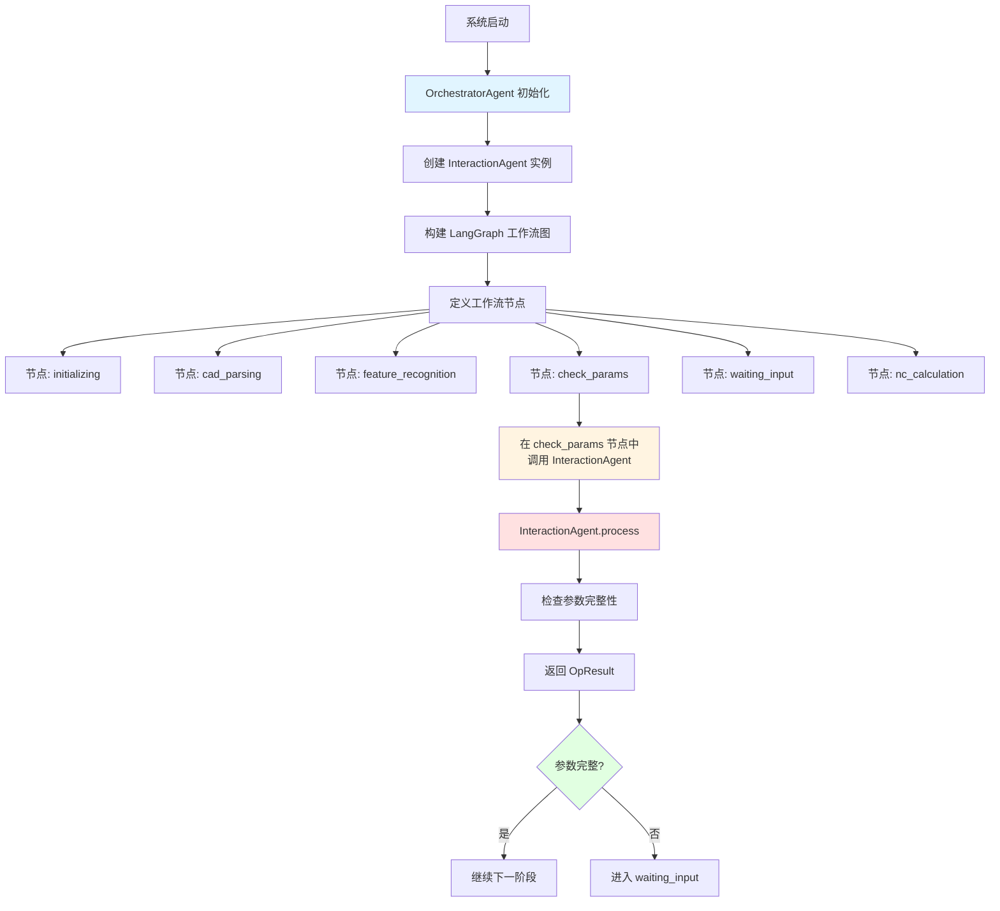

# Agent 调用流程详解

## 🎯 核心问题回答

**是的！InteractionAgent 是通过 OrchestratorAgent 的 LangGraph 工作流图来触发调用的。**

---

## 📊 完整调用流程图



---

## 💻 代码层面的调用关系

### 1. OrchestratorAgent 初始化

```python
# moldCost/agents/orchestrator_agent.py

class OrchestratorAgent(BaseAgent):
    def __init__(self, use_llm_for_interaction: bool = False):
        super().__init__("OrchestratorAgent")
        
        # 步骤1: 创建 InteractionAgent 实例
        # 这里就把 InteractionAgent 作为成员变量
        self.interaction_agent = InteractionAgent(
            use_llm=use_llm_for_interaction
        )
        
        # 步骤2: 构建 LangGraph 工作流
        self.workflow = self._build_workflow()
```

### 2. 构建 LangGraph 工作流图

```python
def _build_workflow(self) -> StateGraph:
    """构建LangGraph工作流"""
    workflow = StateGraph(dict)
    
    # 定义节点 - 每个节点对应一个处理方法
    workflow.add_node("initializing", self._stage_initializing)
    workflow.add_node("cad_parsing", self._stage_cad_parsing)
    workflow.add_node("feature_recognition", self._stage_feature_recognition)
    
    # 关键节点：check_params
    # 这个节点会调用 InteractionAgent
    workflow.add_node("check_params", self._stage_check_params)
    
    workflow.add_node("waiting_input", self._stage_waiting_input)
    workflow.add_node("nc_calculation", self._stage_nc_calculation)
    # ...
    
    # 定义边（节点之间的连接）
    workflow.set_entry_point("initializing")
    workflow.add_edge("initializing", "cad_parsing")
    workflow.add_edge("cad_parsing", "feature_recognition")
    workflow.add_edge("feature_recognition", "check_params")
    
    # 条件分支：根据参数是否完整决定下一步
    workflow.add_conditional_edges(
        "check_params",
        self._should_wait_for_input,
        {
            "wait": "waiting_input",      # 参数缺失 -> 等待用户输入
            "continue": "nc_calculation"   # 参数完整 -> 继续计算
        }
    )
    
    return workflow.compile()
```

### 3. check_params 节点调用 InteractionAgent

```python
async def _stage_check_params(self, state: dict) -> dict:
    """
    阶段3：检查参数
    这个方法会被 LangGraph 工作流自动调用
    """
    logger.info(f"🔍 开始检查参数: job_id={state.get('job_id')}")
    
    state["stage"] = "check_params"
    
    # 关键：这里调用 InteractionAgent
    try:
        # 调用 InteractionAgent 的 process 方法
        result = await self.interaction_agent.process({
            "job_id": state.get("job_id"),
            "features": state.get("features", []),
            "user_input": state.get("user_input", {})
        })
        
        # 根据 InteractionAgent 的返回结果更新状态
        if result.status == "need_input":
            # 参数缺失
            state["missing_params"] = result.data["missing_params"]
            state["interaction_prompt"] = result.data.get("prompt", "")
            logger.info(f"⚠️  参数缺失: {len(result.data['missing_params'])} 个")
        
        elif result.status == "ok":
            # 参数完整
            state["missing_params"] = []
            state["features"] = result.data.get("features", state.get("features", []))
            logger.info(f"✅ 参数完整，继续执行")
        
        else:
            # 错误
            logger.error(f"❌ InteractionAgent 返回错误: {result.message}")
            state["error"] = result.message
    
    except Exception as e:
        logger.error(f"❌ 参数检查失败: {e}", exc_info=True)
        state["error"] = str(e)
        state["missing_params"] = []
    
    return state
```

### 4. 条件判断：是否需要等待用户输入

```python
def _should_wait_for_input(self, state: dict) -> str:
    """
    判断是否需要等待用户输入
    这个方法会被 LangGraph 的条件边调用
    """
    if state.get("missing_params"):
        return "wait"      # 有缺失参数 -> 进入 waiting_input 节点
    return "continue"      # 参数完整 -> 进入 nc_calculation 节点
```

---

## 🔄 完整执行流程

### 场景：用户上传文件后的完整流程

```python
# 1. 系统启动时
orchestrator = OrchestratorAgent(use_llm_for_interaction=False)
# ↓ 内部创建 InteractionAgent 实例
# ↓ 构建 LangGraph 工作流图

# 2. 接收到任务消息（从 RabbitMQ）
initial_state = {
    "job_id": "uuid-123",
    "features": [
        {
            "subgraph_id": "UP01",
            "volume_mm3": 1000,
            # thickness_mm 和 material 缺失
        }
    ]
}

# 3. 执行工作流
result = await orchestrator.workflow.ainvoke(initial_state)

# 工作流执行过程：
# ┌─────────────────────────────────────────┐
# │ LangGraph 自动按照图的定义执行          │
# └─────────────────────────────────────────┘
#
# initializing (阶段0)
#     ↓
# cad_parsing (阶段1)
#     ↓
# feature_recognition (阶段2)
#     ↓
# check_params (阶段3) ← 这里调用 InteractionAgent
#     ↓
#     ├─ 调用: self.interaction_agent.process(...)
#     ├─ InteractionAgent 检查参数
#     ├─ 返回: OpResult(status="need_input", data={...})
#     └─ 更新 state["missing_params"]
#     ↓
# _should_wait_for_input (条件判断)
#     ↓
#     └─ 返回 "wait" (因为有缺失参数)
#     ↓
# waiting_input (阶段4)
#     ↓
#     └─ 推送交互卡片到前端
#     └─ 暂停，等待用户输入
```

---

## 🎭 两层 LangGraph 的关系

### 外层：OrchestratorAgent 的 LangGraph

```python
# 这是主工作流
workflow = StateGraph(dict)
workflow.add_node("check_params", self._stage_check_params)
# ...
```

**职责**：
- 编排整个业务流程
- 决定何时调用哪个 Agent
- 管理全局状态

### 内层：InteractionAgent 的 LangGraph（可选）

```python
# InteractionAgent 内部也有自己的工作流
class InteractionAgent:
    def _build_graph(self):
        workflow = StateGraph(InteractionState)
        workflow.add_node("check_params", self._check_params_node)
        workflow.add_node("generate_prompt", self._generate_prompt_node)
        # ...
```

**职责**：
- 管理参数检查的内部流程
- 处理用户输入验证
- 生成交互提示

### 调用关系

```
OrchestratorAgent.workflow (外层 LangGraph)
    │
    ├─ 节点: check_params
    │   │
    │   └─ 调用: self.interaction_agent.process()
    │       │
    │       └─ InteractionAgent.graph (内层 LangGraph)
    │           │
    │           ├─ 节点: check_params
    │           ├─ 节点: generate_prompt
    │           └─ 节点: validate_input
    │
    └─ 节点: waiting_input
```

---

## 📝 关键点总结

### 1. 触发方式

✅ **通过 LangGraph 工作流图触发**
- OrchestratorAgent 构建工作流图
- 定义 `check_params` 节点
- 节点方法内部调用 InteractionAgent

❌ **不是直接调用**
- 不是在路由层直接调用
- 不是通过 HTTP 接口调用
- 不是独立运行的服务

### 2. 调用时机

InteractionAgent 在以下时机被调用：

1. **首次检查**：特征识别完成后
   ```python
   feature_recognition → check_params → 调用 InteractionAgent
   ```

2. **用户输入后**：用户提交参数后重新检查
   ```python
   用户提交 → 恢复工作流 → check_params → 调用 InteractionAgent
   ```

### 3. 数据流转

```python
# 输入
state = {
    "job_id": "uuid",
    "features": [...],
    "user_input": {...}  # 可选
}

# 调用
result = await self.interaction_agent.process(state)

# 输出
state["missing_params"] = result.data["missing_params"]
state["interaction_prompt"] = result.data["prompt"]
```

### 4. 优势

这种设计的优势：

✅ **解耦**：InteractionAgent 独立，可单独测试
✅ **复用**：可以在多个地方调用
✅ **清晰**：通过工作流图清晰表达业务流程
✅ **灵活**：容易修改和扩展

---

## 🧪 验证调用关系

### 运行测试

```bash
# 测试 InteractionAgent 独立功能
pytest tests/test_interaction_agent.py -v

# 测试 Orchestrator 集成
pytest tests/test_orchestrator_interaction.py -v
```

### 查看日志

```python
# 运行示例时会看到调用日志
python examples/orchestrator_interaction_example.py

# 输出：
# ✅ OrchestratorAgent 初始化完成，InteractionAgent LLM=禁用
# ✅ InteractionAgent 初始化完成 (LLM=禁用)
# 🔍 开始检查参数: job_id=demo-001
# 🔍 InteractionAgent 开始处理: job_id=demo-001
# 🔍 检查参数完整性: job_id=demo-001
# ✅ 参数检查完成: 缺失=2
# ⚠️  参数缺失: 2 个
```

---

## 🎯 最终答案

**是的！InteractionAgent 是通过 OrchestratorAgent 的 LangGraph 工作流图来触发调用的。**

具体来说：
1. OrchestratorAgent 在初始化时创建 InteractionAgent 实例
2. 在构建 LangGraph 工作流时定义 `check_params` 节点
3. 当工作流执行到 `check_params` 节点时，自动调用 `_stage_check_params` 方法
4. 该方法内部调用 `self.interaction_agent.process()` 来检查参数
5. 根据返回结果，LangGraph 通过条件边决定下一步流程

这是一个典型的**工作流编排模式**，通过 LangGraph 的状态机来管理复杂的业务流程。

---

**版本**: 1.0.0  
**更新日期**: 2024-01-15  
**负责人**: 人员B1, 人员B2
