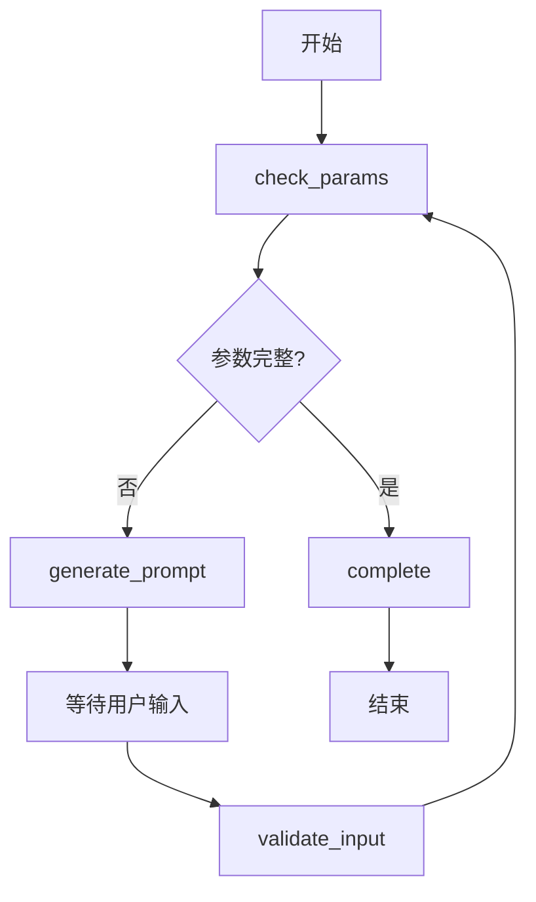

# InteractionAgent V2 - LangGraph 版本

## 概述

基于 LangGraph 框架重构的用户交互Agent，提供更强大的状态管理和工作流编排能力。

## 架构设计

### 工作流图



### 核心组件

1. **InteractionAgentV2** - LangGraph 实现
   - 状态管理
   - 条件路由
   - LLM 集成（可选）

2. **InteractionAgent** - 兼容层包装器
   - 保持原有接口
   - 内部调用 V2 实现

## 功能特性

### 1. 参数检查
- 自动检测缺失参数
- 支持多种参数类型（number, select, text）
- 按子图分组管理

### 2. 智能提示生成
- **简单模式**：模板化提示
- **AI 模式**：使用 LLM 生成友好提示

### 3. 状态管理
- 完整的消息历史
- 用户输入验证
- 参数合并更新

### 4. 工作流可视化
- 支持 Mermaid 图表
- 便于调试和理解

## 使用方法

### 基础使用（不使用 LLM）

```python
from agents.interaction_agent_wrapper import InteractionAgent

agent = InteractionAgent(use_llm=False)

context = {
    "job_id": "test-001",
    "features": [
        {
            "subgraph_id": "UP01",
            "volume_mm3": 1000,
            # thickness_mm 和 material 缺失
        }
    ]
}

result = await agent.process(context)

if result.status == "need_input":
    print(result.data["prompt"])
    print(result.data["missing_params"])
```

### 使用 LLM 增强

```python
# 需要配置环境变量: OPENAI_API_KEY
agent = InteractionAgent(use_llm=True)

result = await agent.process(context)
# AI 会生成更友好的提示语
```

### 用户补充参数

```python
# 用户输入参数
context["user_input"] = {
    "UP01": {
        "thickness_mm": 30,
        "material": "P20"
    }
}

result = await agent.process(context)

if result.status == "ok":
    print("参数已完整!")
    updated_features = result.data["features"]
```

## 配置说明

### 环境变量

```bash
# 可选：启用 LLM 功能
OPENAI_API_KEY=sk-xxx

# 可选：自定义模型
OPENAI_MODEL=gpt-4o-mini
```

### 参数类型定义

```python
{
    "subgraph_id": "UP01",
    "param_name": "thickness_mm",
    "param_label": "厚度(mm)",
    "param_type": "number",  # number | select | text
    "required": True,
    "options": ["P20", "718"]  # 仅 select 类型需要
}
```

## 与原版本对比

| 特性 | 原版本 | V2 版本 |
|------|--------|---------|
| 框架 | 无 | LangGraph |
| 状态管理 | 手动 | 自动 |
| 工作流可视化 | ❌ | ✅ |
| LLM 集成 | ❌ | ✅ |
| 消息历史 | ❌ | ✅ |
| 条件路由 | 手动 | 声明式 |
| 向后兼容 | - | ✅ |

## 性能优化

1. **LLM 缓存**：相同提示复用结果
2. **异步处理**：完全异步实现
3. **按需加载**：LLM 可选启用

## 扩展性

### 添加新的参数检查规则

```python
# 在 _check_params 方法中添加
if feature.get("needs_special_check"):
    missing.append({
        "subgraph_id": subgraph_id,
        "param_name": "special_param",
        "param_label": "特殊参数",
        "param_type": "text"
    })
```

### 自定义提示生成

```python
# 继承并重写 _generate_prompt
class CustomInteractionAgent(InteractionAgentV2):
    def _generate_simple_prompt(self, missing):
        # 自定义逻辑
        return "自定义提示"
```

## 测试

运行示例：
```bash
cd moldCost
python examples/interaction_agent_example.py
```

## 故障排查

### 问题 1: LangGraph 导入失败
```bash
pip install "langgraph>=1.0,<2.0"
```

### 问题 2: OpenAI API 错误
- 检查 `OPENAI_API_KEY` 环境变量
- 确认 API Key 有效
- 使用 `use_llm=False` 禁用 LLM

### 问题 3: 状态不一致
- 检查 `features` 格式是否正确
- 确保 `subgraph_id` 唯一

## 最佳实践

1. **生产环境建议禁用 LLM**（降低成本和延迟）
2. **使用简单模式**已经足够友好
3. **记录所有交互历史**便于审计
4. **定期更新参数规则**适应业务变化

## 未来计划

- [ ] 支持多轮对话
- [ ] 参数智能推荐
- [ ] 历史输入学习
- [ ] 多语言支持
- [ ] 参数依赖关系处理

## 贡献者

- 负责人：人员B2
- 框架重构：2024-01
