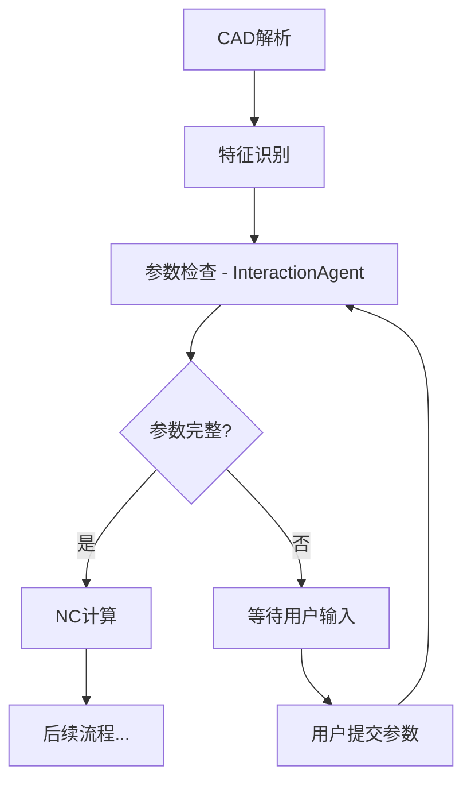

# Orchestrator 与 InteractionAgent 集成文档

## 概述

InteractionAgent 已成功集成到 OrchestratorAgent 工作流中，实现了自动化的参数检查和用户交互流程。

## 集成架构



## 核心功能

### 1. 自动参数检查

Orchestrator 在 `check_params` 阶段自动调用 InteractionAgent：

```python
orchestrator = OrchestratorAgent(use_llm_for_interaction=False)

state = {
    "job_id": "job-123",
    "features": [
        {
            "subgraph_id": "UP01",
            "volume_mm3": 1000,
            # 缺失参数...
        }
    ]
}

result = await orchestrator._stage_check_params(state)

if result["missing_params"]:
    # 需要用户输入
    await orchestrator._stage_waiting_input(result)
```

### 2. 条件路由

根据参数完整性自动决策：

```python
def _should_wait_for_input(state: dict) -> str:
    if state.get("missing_params"):
        return "wait"  # 进入等待用户输入阶段
    return "continue"  # 继续执行工作流
```

### 3. 用户输入处理

用户通过 WebSocket 或 HTTP 提交参数后：

```python
# 用户输入
state["user_input"] = {
    "UP01": {
        "thickness_mm": 30,
        "material": "P20"
    }
}

# 重新检查参数
result = await orchestrator._stage_check_params(state)
# 参数已更新，继续执行
```

## 工作流状态

### 状态字段

```python
state = {
    "job_id": str,                    # 任务ID
    "stage": str,                     # 当前阶段
    "features": List[Dict],           # 特征列表
    "missing_params": List[Dict],     # 缺失参数列表
    "interaction_prompt": str,        # 用户提示
    "user_input": Dict,               # 用户输入
    "progress": int,                  # 进度百分比
    "error": str                      # 错误信息（可选）
}
```

### 阶段流转

1. **check_params** - 检查参数完整性
   - 调用 InteractionAgent
   - 设置 `missing_params` 和 `interaction_prompt`

2. **waiting_input** - 等待用户输入
   - 推送交互卡片到前端
   - 暂停工作流
   - 等待用户提交

3. **恢复执行** - 用户提交后
   - 通过 RabbitMQ 消息恢复
   - 重新进入 `check_params`
   - 验证参数并继续

## 配置选项

### 启用/禁用 LLM

```python
# 简单模式（推荐生产环境）
orchestrator = OrchestratorAgent(use_llm_for_interaction=False)

# AI 模式（需要 OPENAI_API_KEY）
orchestrator = OrchestratorAgent(use_llm_for_interaction=True)
```

### 环境变量

```bash
# 可选：启用 LLM
OPENAI_API_KEY=sk-xxx
OPENAI_MODEL=gpt-4o-mini
```

## 使用示例

### 示例 1: 基础集成

```python
from agents.orchestrator_agent import OrchestratorAgent

orchestrator = OrchestratorAgent()

# 执行工作流
result = await orchestrator.process({
    "job_id": "job-123",
    "features": [...]
})
```

### 示例 2: 手动调用阶段

```python
# 参数检查
state = await orchestrator._stage_check_params(initial_state)

# 判断是否需要等待
if orchestrator._should_wait_for_input(state) == "wait":
    # 等待用户输入
    state = await orchestrator._stage_waiting_input(state)
```

### 示例 3: 处理用户输入

```python
# 用户提交参数
state["user_input"] = {
    "UP01": {"thickness_mm": 30, "material": "P20"}
}

# 重新检查
state = await orchestrator._stage_check_params(state)

# 继续执行
if state["missing_params"] == []:
    state = await orchestrator._stage_nc_calculation(state)
```

## 与前端集成

### 1. WebSocket 推送

```python
# Orchestrator 推送交互需求
await orchestrator._publish_interaction(job_id, {
    "type": "interaction_required",
    "missing_params": [...],
    "prompt": "请补充参数"
})

# 前端监听
ws.onmessage = (event) => {
    const data = JSON.parse(event.data);
    if (data.type === "interaction_required") {
        showInteractionCard(data);
    }
}
```

### 2. HTTP 提交

```python
# 前端提交
POST /api/v1/jobs/{job_id}/submit
{
    "card_id": "uuid",
    "action": "submit",
    "inputs": {
        "UP01.thickness_mm": 30,
        "UP01.material": "P20"
    }
}

# 后端处理
# 1. 保存用户输入
# 2. 发送 RabbitMQ 消息恢复工作流
# 3. Orchestrator 重新检查参数
```

## 测试

### 运行测试

```bash
# 集成测试
pytest tests/test_orchestrator_interaction.py -v

# 运行示例
python examples/orchestrator_interaction_example.py
```

### 测试覆盖

- ✅ 参数完整的情况
- ✅ 参数缺失的情况
- ✅ 用户补充参数
- ✅ 多个特征处理
- ✅ 条件路由判断
- ✅ 等待用户输入阶段

## 性能指标

| 指标 | 简单模式 | AI 模式 |
|------|---------|---------|
| 参数检查时间 | < 10ms | ~300ms |
| 内存占用 | 低 | 中 |
| 并发能力 | 高 | 中 |

## 故障排查

### 问题 1: InteractionAgent 未初始化

```python
# 确保 Orchestrator 正确初始化
orchestrator = OrchestratorAgent(use_llm_for_interaction=False)
```

### 问题 2: 参数未更新

```python
# 确保 user_input 格式正确
state["user_input"] = {
    "subgraph_id": {
        "param_name": value
    }
}
```

### 问题 3: Redis 推送失败

```python
# 检查 Redis 连接
from api_gateway.utils.redis_client import redis_client
await redis_client.connect()
```

## 最佳实践

### 1. 生产环境配置

```python
# 禁用 LLM，提高性能
orchestrator = OrchestratorAgent(use_llm_for_interaction=False)
```

### 2. 错误处理

```python
try:
    result = await orchestrator._stage_check_params(state)
except Exception as e:
    logger.error(f"参数检查失败: {e}")
    # 降级处理
```

### 3. 日志记录

```python
import logging
logging.basicConfig(level=logging.INFO)

# Orchestrator 会自动记录关键事件
```

### 4. 状态持久化

```python
# 保存状态到数据库
await save_job_state(job_id, state)

# 恢复状态
state = await load_job_state(job_id)
```

## 未来计划

- [ ] 支持参数依赖关系
- [ ] 智能参数推荐
- [ ] 批量参数验证
- [ ] 实时参数校验
- [ ] 参数历史记录

## 相关文档

- [InteractionAgent 文档](README.md)
- [Orchestrator 文档](../docs/orchestrator.md)
- [WebSocket 集成](../api_gateway/websocket.py)

---

**版本**: 1.0.0  
**更新日期**: 2024-01-15  
**负责人**: 人员B1, 人员B2
