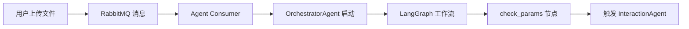

# InteractionAgent 触发方式汇总

## 📊 当前触发方式总览

目前有 **4 种方式** 可以触发 InteractionAgent：

| 方式 | 场景 | 状态 | 说明 |
|------|------|------|------|
| 1. OrchestratorAgent 工作流 | 生产环境 | ✅ 已实现 | 主要方式 |
| 2. 直接调用（测试） | 单元测试 | ✅ 已实现 | 测试用 |
| 3. 示例脚本 | 开发调试 | ✅ 已实现 | 学习用 |
| 4. HTTP API（可选） | 独立服务 | ⏳ 可扩展 | 未实现 |

---

## 方式 1: 通过 OrchestratorAgent 工作流触发 ✅

### 使用场景
**生产环境的主要方式** - 在完整的业务流程中自动触发

### 触发流程



### 代码实现

```python
# moldCost/agents/orchestrator_agent.py

class OrchestratorAgent(BaseAgent):
    def __init__(self, use_llm_for_interaction: bool = False):
        super().__init__("OrchestratorAgent")
        
        # 初始化时创建 InteractionAgent 实例
        self.interaction_agent = InteractionAgent(
            use_llm=use_llm_for_interaction
        )
        
        self.workflow = self._build_workflow()
    
    async def _stage_check_params(self, state: dict) -> dict:
        """
        阶段3：检查参数
        在 LangGraph 工作流中自动调用
        """
        # 触发 InteractionAgent
        result = await self.interaction_agent.process({
            "job_id": state.get("job_id"),
            "features": state.get("features", []),
            "user_input": state.get("user_input", {})
        })
        
        # 处理结果
        if result.status == "need_input":
            state["missing_params"] = result.data["missing_params"]
            state["interaction_prompt"] = result.data.get("prompt", "")
        
        return state
```

### 触发时机

1. **首次检查**：特征识别完成后
   ```
   feature_recognition → check_params → InteractionAgent
   ```

2. **用户输入后**：用户提交参数后重新检查
   ```
   用户提交 → 恢复工作流 → check_params → InteractionAgent
   ```

### 优点
- ✅ 自动化，无需手动干预
- ✅ 集成在完整业务流程中
- ✅ 状态管理由 LangGraph 处理
- ✅ 支持工作流暂停和恢复

### 缺点
- ❌ 依赖完整的工作流环境
- ❌ 调试相对复杂

---

## 方式 2: 直接调用（单元测试）✅

### 使用场景
**单元测试和集成测试** - 独立测试 InteractionAgent 的功能

### 代码实现

```python
# moldCost/tests/test_interaction_agent.py

import pytest
from agents.interaction_agent import InteractionAgent

@pytest.mark.asyncio
async def test_basic_missing_params():
    """测试基础参数缺失检测"""
    
    # 直接创建实例
    agent = InteractionAgent(use_llm=False)
    
    # 准备测试数据
    context = {
        "job_id": "test-001",
        "features": [
            {
                "subgraph_id": "UP01",
                "volume_mm3": 1000,
                # thickness_mm 和 material 缺失
            }
        ]
    }
    
    # 直接调用
    result = await agent.process(context)
    
    # 验证结果
    assert result.status == "need_input"
    assert len(result.data["missing_params"]) == 2
```

### 运行方式

```bash
# 运行所有测试
pytest tests/test_interaction_agent.py -v

# 运行单个测试
pytest tests/test_interaction_agent.py::test_basic_missing_params -v

# 查看详细输出
pytest tests/test_interaction_agent.py -v -s
```

### 优点
- ✅ 快速验证功能
- ✅ 独立测试，不依赖其他组件
- ✅ 易于调试
- ✅ 支持自动化测试

### 缺点
- ❌ 不是真实的业务场景
- ❌ 需要手动构造测试数据

---

## 方式 3: 示例脚本（开发调试）✅

### 使用场景
**学习和演示** - 展示 InteractionAgent 的使用方法

### 代码实现

```python
# moldCost/examples/interaction_agent_example.py

import asyncio
from agents.interaction_agent import InteractionAgent

async def example_basic():
    """基础示例：检查参数缺失"""
    
    # 创建实例
    agent = InteractionAgent(use_llm=False)
    
    # 模拟上下文
    context = {
        "job_id": "demo-001",
        "features": [
            {
                "subgraph_id": "UP01",
                "volume_mm3": 1000,
            }
        ]
    }
    
    # 调用
    result = await agent.process(context)
    
    # 显示结果
    if result.status == "need_input":
        print("缺失参数:")
        for param in result.data["missing_params"]:
            print(f"  • {param['param_label']}")
        
        print(f"\n用户提示:\n{result.data['prompt']}")

async def main():
    await example_basic()
    # 更多示例...

if __name__ == "__main__":
    asyncio.run(main())
```

### 运行方式

```bash
# 运行示例
python examples/interaction_agent_example.py

# 运行 Orchestrator 集成示例
python examples/orchestrator_interaction_example.py
```

### 优点
- ✅ 直观易懂
- ✅ 完整的使用示例
- ✅ 适合学习和演示
- ✅ 可以快速验证功能

### 缺点
- ❌ 不是生产环境代码
- ❌ 需要手动运行

---

## 方式 4: HTTP API 触发（可扩展）⏳

### 使用场景
**独立服务模式** - 将 InteractionAgent 作为独立的微服务

### 潜在实现（未实现）

```python
# moldCost/api_gateway/routers/interaction_check.py (示例)

from fastapi import APIRouter, Depends
from agents.interaction_agent import InteractionAgent

router = APIRouter(prefix="/api/v1/interaction", tags=["interaction"])

# 全局实例（或使用依赖注入）
interaction_agent = InteractionAgent(use_llm=False)

@router.post("/check-params")
async def check_params(
    data: dict,
    current_user: dict = Depends(get_current_user)
):
    """
    独立的参数检查接口
    
    请求体:
    {
        "job_id": "uuid",
        "features": [...]
    }
    
    响应:
    {
        "status": "need_input",
        "missing_params": [...],
        "prompt": "..."
    }
    """
    result = await interaction_agent.process(data)
    
    return {
        "status": result.status,
        "message": result.message,
        "data": result.data
    }
```

### 使用方式（如果实现）

```bash
# HTTP 调用
curl -X POST "http://localhost:8211/api/v1/interaction/check-params" \
  -H "Authorization: Bearer {token}" \
  -H "Content-Type: application/json" \
  -d '{
    "job_id": "uuid",
    "features": [
      {
        "subgraph_id": "UP01",
        "volume_mm3": 1000
      }
    ]
  }'
```

### 优点
- ✅ 可以独立部署
- ✅ 支持跨语言调用
- ✅ 易于集成到其他系统
- ✅ 支持负载均衡

### 缺点
- ❌ 增加系统复杂度
- ❌ 需要额外的接口维护
- ❌ 可能与工作流集成冲突

### 是否需要实现？

**当前不需要**，因为：
1. InteractionAgent 已经通过 Orchestrator 集成
2. 增加 HTTP 接口会导致调用路径混乱
3. 测试和示例已经足够

**未来可能需要**，如果：
1. 需要独立的参数检查服务
2. 其他系统需要调用
3. 需要支持批量参数检查

---

## 📊 触发方式对比

| 特性 | Orchestrator | 直接调用 | 示例脚本 | HTTP API |
|------|-------------|---------|---------|----------|
| 生产环境 | ✅ 主要方式 | ❌ | ❌ | ⏳ 可选 |
| 测试 | ✅ 集成测试 | ✅ 单元测试 | ✅ 手动测试 | ⏳ |
| 学习演示 | ❌ | ❌ | ✅ 最佳 | ❌ |
| 独立部署 | ❌ | ❌ | ❌ | ✅ |
| 复杂度 | 高 | 低 | 低 | 中 |
| 维护成本 | 中 | 低 | 低 | 高 |

---

## 🎯 推荐使用方式

### 开发阶段

1. **学习和理解**
   ```bash
   python examples/interaction_agent_example.py
   ```

2. **功能测试**
   ```bash
   pytest tests/test_interaction_agent.py -v
   ```

3. **集成测试**
   ```bash
   pytest tests/test_orchestrator_interaction.py -v
   ```

### 生产环境

**只使用 Orchestrator 工作流触发**
```python
# 通过 RabbitMQ 消息触发
# → Agent Consumer
# → OrchestratorAgent
# → LangGraph 工作流
# → check_params 节点
# → InteractionAgent
```

---

## 🔄 完整调用链路（生产环境）

```
1. 用户上传文件
   ↓
2. API Gateway 创建任务
   ↓
3. 发送 RabbitMQ 消息
   ↓
4. Agent Consumer 接收消息
   ↓
5. 创建 OrchestratorAgent 实例
   ├─ 初始化 InteractionAgent
   └─ 构建 LangGraph 工作流
   ↓
6. 执行工作流
   ├─ initializing
   ├─ cad_parsing
   ├─ feature_recognition
   ├─ check_params ← 触发 InteractionAgent
   │   ├─ 调用: interaction_agent.process()
   │   ├─ 检查参数
   │   └─ 返回结果
   ├─ 条件判断
   │   ├─ 参数完整 → nc_calculation
   │   └─ 参数缺失 → waiting_input
   └─ ...
```

---

## 📝 总结

### 当前已实现的触发方式

1. ✅ **OrchestratorAgent 工作流** - 生产环境主要方式
2. ✅ **直接调用（测试）** - 单元测试和集成测试
3. ✅ **示例脚本** - 学习和演示

### 未来可扩展的方式

4. ⏳ **HTTP API** - 独立服务模式（可选）

### 最佳实践

- **生产环境**：只通过 Orchestrator 触发
- **开发测试**：使用测试和示例脚本
- **学习演示**：运行示例脚本
- **功能验证**：运行单元测试

---

**版本**: 1.0.0  
**更新日期**: 2024-01-15  
**负责人**: 人员B2
